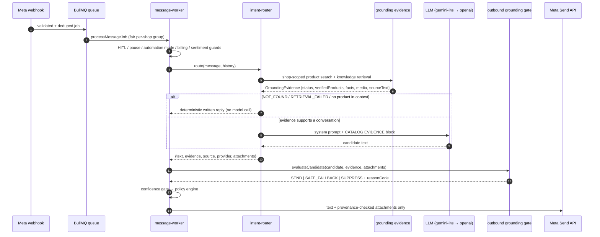

# The AI Trust Boundary

**Date** 2026-08-09 · **Status: authoritative.**

> **LLM output is a candidate response, not an authoritative response.**
> The LLM is a language-generation component. It may phrase, translate, summarise and
> conversationally present facts EasyModerator has verified. It must never create them.

Merchant-specific facts — whether a product exists, its name, price, stock, variants, sizes,
colours, material, specifications, discounts, images, URLs, delivery information, policies and
FAQs — come from EasyModerator-owned data or they do not go out.

---

## 1. Why this exists

A production Messenger conversation: a customer asked about a saree the merchant does not sell.
The assistant replied as though it existed, invented availability, treated "is it chiffon?" as a
question it could answer, and — under repeated pressure for a real product photo — offered the
merchant's Facebook Page link instead.

Five independent defects made that possible. All are closed by the boundary described here; the
audit detail is in §9.

---

## 2. Authoritative data sources

| Fact | Source of truth | Read through |
| --- | --- | --- |
| Product existence, name, price, stock, variants | `products` rows, always `WHERE shop_id = :shopId` | `product-search.service` |
| Product media | `products.images` / `products.image_url` on the **same row** | `product-evidence.service` |
| Merchant knowledge, policies, FAQs | `faq_responses`, knowledge documents, vector store | `knowledge.service`, `rag.service` |
| Payment methods, delivery configuration | shop settings | `shop-operating-context.service` |
| Order state | `orders` | `intent-router` stage 1.5 |

Nothing else is authoritative. Notably **not**: the model's own output, its stated confidence,
its earlier replies in the conversation, or a vector-store similarity score.

---

## 3. Runtime flow



The gate is the last thing between generation and Meta. Provider selection happens **inside** it:
`llm.service` picks gemini-lite, gemini-pro or the OpenAI fallback, and every one of those paths
returns to the same `evaluateCandidate` call. A future provider inherits the guarantees by
construction.

---

## 4. Product grounding lifecycle

**SEARCH CANDIDATE ≠ VERIFIED PRODUCT ENTITY.** The SQL search uses OR semantics, so
"chiffon saree ache?" returns every saree the shop has. Those rows are candidates.

Verification is conjunctive and deterministic: a candidate becomes a **verified product entity**
only when *every* product-identifying term the customer supplied appears in that product's
structured catalog fields (name, name_bn, category, brand, recorded colour, recorded material,
tags, variant options). There is no similarity threshold to tune.

- Intent words are stripped first (`ache`, `koto`, `দাম`, `picture`, …) — they identify a question,
  not a product.
- Bengali case suffixes and the English plural are stemmed, so "জামার" and "sarees" still match.
- Product **descriptions are excluded** on purpose: "drapes like chiffon" must not verify chiffon.

| Outcome | Meaning | Behaviour |
| --- | --- | --- |
| `NONE` | no product entity was asked about | normal conversation |
| `VERIFIED` | ≥1 product in this shop matches every term | facts may be stated, from the record |
| `NOT_FOUND` | a product was asked about; catalog has none | written not-found reply, **no model call** |
| `RETRIEVAL_FAILED` | catalog could not be read | written "I'll confirm shortly" + human handoff |

Products that match *some* terms are `relatedProducts` — real rows of this shop, and the only
things that may be offered as alternatives.

**Attribute follow-ups** ("eta chiffon?") name no product. They are resolved against the products
this conversation already grounded, carried on the previous AI message's `source_references` and
**re-read live under the asking shop's ID**. With nothing in context, the reply asks which product
they mean — which is also what stops an earlier hallucinated "chiffon saree" from becoming the
subject under discussion.

---

## 5. Fact-level grounding

Product existence is not permission to invent attributes. Every verified product carries a fact
table where each attribute is `KNOWN`, `UNKNOWN` or `NOT_APPLICABLE`, and `UNKNOWN` is **printed
explicitly** in the prompt:

```
1. Premium Black Saree [product_id=p-1]
   Price: ৳1490
   Stock: IN_STOCK
   Material: UNKNOWN — not recorded in this shop's catalog
   Photo: none stored for this product
```

Omitting a NULL column — the previous behaviour — reads to a model as "not mentioned, use your
judgement". When the customer asks about an attribute recorded as `UNKNOWN`, the gate requires the
reply to actually say so; a reply that names a fabric without admitting uncertainty is replaced by
one that states the known facts and the unknown one.

---

## 6. Image grounding rules

A product image may be sent only when it belongs to a verified product record owned by the current
shop. Concretely, before an attachment reaches Meta:

- the URL came from the `images`/`image_url` column of a row fetched under `shop_id = :shopId`;
- it is an absolute `https:` URL (no `data:`, no relative path, no plain `http`);
- `attachment.productId`, when present, equals `evidence.mediaProductId`;
- `attachment.url` equals `evidence.mediaUrl` exactly.

Anything else is dropped and logged as `attachment_provenance_rejected`.

| Situation | Reply | Attachment |
| --- | --- | --- |
| No verified product | "I can't find that product… so I have no photo to send" | none |
| Verified, no stored media | "I don't have a photo of this product available" | none |
| Verified, valid media | normal grounded reply | that product's image |

**URLs in text are separately policed.** Merchant-configured links (shop page, socials) are
allowed in ordinary conversation, but **once a photo has been requested the media rules own every
URL in the reply** — which is precisely what stops "here's our Facebook Page" from answering
"send the real picture". Any URL not on the allowlist is rejected, which also covers fabricated
media URLs and links injected through the customer's message.

---

## 7. Knowledge grounding

Retrieved knowledge snippets and matched FAQ text are recorded as this reply's `sourceText`. A
figure the reply states must appear there (or in a verified product's facts) — so a delivery
charge quoted from the merchant's own FAQ passes, and a return-policy fee the merchant never
supplied is rejected as `UNSUPPORTED_PRICE_CLAIM`. If the merchant never supplied the information,
the assistant says so rather than inventing a merchant-specific answer. General conversational
language remains allowed where it creates no merchant fact.

---

## 8. The outbound SEND decision

`grounding/outbound-grounding.gate.js` — deterministic, no model call.

| # | Check | Reason code on failure |
| --- | --- | --- |
| 1 | candidate is a usable string | `MODEL_OUTPUT_INVALID` |
| 2 | catalog was readable | `RETRIEVAL_FAILED` |
| 3 | no availability asserted for an absent product | `PRODUCT_NOT_FOUND` |
| 4 | every currency figure appears in `sourceText` | `UNSUPPORTED_PRICE_CLAIM` |
| 5 | every URL is on the evidence allowlist | `UNSUPPORTED_URL_CLAIM` |
| 6 | an `UNKNOWN` attribute is answered as unknown | `PRODUCT_ATTRIBUTE_UNKNOWN` |
| 7 | attachments pass provenance | `attachment_provenance_rejected` (violation) |

Outcomes: **SEND** (unchanged text), **SAFE_FALLBACK** (text replaced wholesale by written copy —
never edited model output), **SUPPRESS** (nothing truthful can be said; the worker escalates to a
human and sends nothing).

`RETRIEVAL_FAILED` additionally sets `confidence = 0`, which routes the turn into the existing
low-confidence hold + human handoff rather than inventing a new UX.

**EasyModerator-authored text is not model output.** Order-flow steps, greeting templates and the
gate's own written replies are marked `modelGenerated: false` and skip claim validation — they
state facts we computed ourselves. Attachment provenance is enforced for them regardless. The
`MODEL_REPLY_SOURCES` set (`llm`, `faq`, `cache`) defines the boundary.

---

## 9. What was wrong before

| # | Defect | Closed by |
| --- | --- | --- |
| 1 | Empty product retrieval appended nothing to the prompt — indistinguishable from "no product was asked about" | `NOT_FOUND` is an explicit state with its own written reply |
| 2 | OR-search candidates injected under "use ONLY these facts" | conjunctive verification (§4) |
| 3 | NULL attributes silently omitted | explicit `UNKNOWN` rendering (§5) |
| 4 | `guardrail.service.validateResponse` had **zero callers**; `hallucination-detector` was a stub that never fired | the gate runs in `message-worker` on every reply; the stub is deleted |
| 5 | `_callLlm` returned a hard-coded `confidence: 0.9`, above the 0.75 threshold — the model authorised itself | grounding decisions are made from evidence, not confidence |
| 6 | Prompt said "maintain consistency with earlier statements" while prior AI turns were replayed verbatim | history is explicitly context-not-evidence; deterministic paths re-derive per turn |
| 7 | `.catch(() => [])` on product search made an outage look like "no such product" | retrieval errors become `RETRIEVAL_FAILED`, never `NOT_FOUND` |
| 8 | Worker hard-coded `attachments: []`; the Page URL sat in the prompt | provenance-checked attachments + URL allowlist (§6) |
| 9 | LLM replies cached 30 min per (shop, message) — a hallucination, or a stale price, served repeatedly | only replies carrying no product facts are cached |

---

## 10. Failure behaviour (fail closed)

| Failure | Behaviour |
| --- | --- |
| PostgreSQL / catalog error | `RETRIEVAL_FAILED` → written reply + human handoff |
| Vector store / embeddings error | knowledge omitted; product truth decided independently; never a licence to claim |
| Non-semantic embedder | vector product hits dropped before becoming candidates |
| Primary LLM failure | `llm.service` fails over; the same gate runs on the result |
| All providers fail | the worker's existing catch emits the generic fallback at `confidence: 0` → held |
| Malformed / empty model output | `MODEL_OUTPUT_INVALID` → safe fallback, or SUPPRESS when nothing can be said |
| Media lookup failure | no attachment; the reply states the photo is unavailable |

Uncertain system state is never permission to hallucinate.

---

## 11. Observability

One structured event per reply, from `grounding.logGroundingDecision`:

`grounded_reply_sent` · `product_not_found` · `product_attribute_unknown` ·
`product_image_unavailable` · `knowledge_not_found` · `grounding_validation_failed` ·
`model_output_rejected` · `reply_suppressed` · `retrieval_failed`

Correlation fields: `shopId`, `conversationId`, `messageId`, `provider`, `decision`, `reasonCode`,
`productStatus`, `mediaStatus`, `verifiedProductIds`, `mediaProductId`, `knowledgeIds`,
`violations`. `SEND` logs at INFO, everything else at WARN.

Never logged: message bodies, tokens, credentials, Meta access tokens, customer PII.

The same `grounding_decision` / `grounding_reason` / `grounding_product_status` fields are stamped
on the stored `Message.metadata`, so a specific reply in the inbox can be explained after the fact.

---

## 12. Performance and cost

- **Fewer LLM calls, not more.** `NOT_FOUND`, `RETRIEVAL_FAILED` and "which product?" turns are
  answered deterministically with **zero** model calls. Repeated pressure ("abar check koren")
  costs nothing.
- **No extra retrieval.** The gate reuses the evidence generation already produced. There is no
  second vector search and no verification model.
- **One fewer round trip on the critical path.** Product search and knowledge retrieval now run
  concurrently (`Promise.all`); previously RAG ran after the product search.
- **Added work is in-process string matching** over ≤5 product rows: term extraction, containment
  checks, one regex sweep of the candidate. Sub-millisecond, no I/O.
- The context-product lookup for attribute follow-ups is one indexed `IN (…)` query, on a turn
  that would otherwise have run a full-text search.

---

## 13. Extending grounding safely

1. **Add the fact to evidence first.** If a new merchant fact should be stateable, give it a
   source and put it in `GroundingEvidence` — do not add it to the prompt alone. Anything not in
   `sourceText` is, by construction, unquotable.
2. **Never widen `MODEL_REPLY_SOURCES` to make a check go away.** That set marks text
   EasyModerator authored; adding a model-backed source to it removes the boundary.
3. **New provider?** Add it to `llm.service.PROVIDERS`. Do not add a code path that reaches Meta
   without `evaluateCandidate`.
4. **New reply path?** It must return `{ text, grounding, source }` and pass through the gate.
   A path that sends directly from a controller or worker is a bypass.
5. **Prefer a deterministic answer to a prompt instruction.** If the catalog already settles the
   question, answer it in code: it is cheaper, testable, and immune to phrasing.
6. **Keep the rules in one place.** `grounding-prompt.js` (what we tell the model) and
   `outbound-grounding.gate.js` (what we enforce) read the same contract; a rule that lives in
   only one of them will drift.

Regression coverage: `src/modules/ai/grounding/__tests__/grounding-boundary.test.js` (service
boundary), `src/jobs/__tests__/message-worker.grounding.test.js` (what actually reaches Meta),
and `tests/meta-e2e/` — the full production-shaped path from a signed Meta webhook to the Graph
Send API, with only the two outermost network transports captured. Setup, fixtures and the
real-Meta smoke procedure: `docs/testing/META_E2E_TEST_SETUP.md`.
