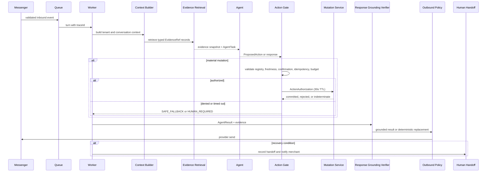

# Conversation Recovery Policy

Version: 1.0.0<br>
Last updated: 2026-08-22<br>
Owner: Engineering + Product<br>
Supersedes: Recovery and failure portions of `EASYMODERATOR_DOMAIN_AGENT_RUNTIME_VISION.md`<br>
Status: Normative; customer experience and reliability gate

MUST / MUST NOT / REQUIRED are binding: violating one blocks merge. SHOULD / RECOMMENDED may be deviated from with a recorded ADR. MAY is optional. Any rule affecting authorization, tenant isolation, idempotency, or material mutation MUST be written as MUST.

This document owns customer-visible processing states, timeout behavior, retry and reconciliation, deterministic holding messages, human handoff, and recovery telemetry. Action authorization and post-mutation communication are owned by [Agent Action Policy](./AGENT_ACTION_POLICY.md).

## 1. Recovery Principles

- A customer never waits in silence for an internal timeout.
- A retry MUST preserve the original `traceId`, action ID, evidence snapshot, and deterministic idempotency key.
- A provider timeout is an unknown state until reconciled; it is not a failure that authorizes a second external write.
- Recovery messages state what the system knows and do not promise a delivery time, discount, urgency, or stock condition that evidence does not support.
- `HUMAN_REQUIRED` stops automated domain transitions for the turn.
- Draft, shadow, and active turns consume the global model budget unless a deterministic path uses zero calls.

## 2. Customer-Visible State Map

| Internal state | Entry condition | Customer behavior | Merchant behavior | Timeout or exit |
|---|---|---|---|---|
| `RECEIVED` | Webhook is validated and stored | No response yet; typing indicator may start | None | Move to context build within 1 second. |
| `CONTEXT_BUILDING` | Tenant, customer, conversation, and consent load | Typing indicator | None | On 500 ms breach continue; on hard timeout send holding copy. |
| `EVIDENCE_RETRIEVING` | Typed evidence reads are running | Typing indicator | None | Retrieval failure becomes safe holding plus handoff. |
| `AGENT_RUNNING` | Deterministic or model agent is processing | Typing indicator | None | Provider failure enters fallback chain, then recovery. |
| `AWAITING_CONFIRMATION` | Order summary is ready or was invalidated | Send exact summary and strict confirmation instruction | Order session visible as awaiting customer confirmation | Expires with session TTL; no mutation. |
| `ACTION_GATE` | Proposed mutation is being checked | Typing indicator | None | Denial becomes safe copy or handoff; no mutation. |
| `MUTATING` | Authorized local or external mutation started | Typing indicator | Activity row visible | Commit, reject, or indeterminate reconciliation. |
| `VERIFYING_RESPONSE` | Mutation/result or candidate is being grounded | Typing indicator | None | Output must proceed through Outbound Policy. |
| `SAFE_FALLBACK` | Candidate is unsupported or a deterministic safe response exists | Send deterministic explanation or holding copy | Store reason and evidence status | Return to normal routing on next customer turn. |
| `HUMAN_REQUIRED` | Uncertainty, complaint, policy denial, or unsafe action | Send holding message naming human handoff | Notify merchant immediately | Human acknowledgement target 5 minutes; escalation at 15 minutes. |
| `SENT` | Provider accepted the outbound message | Customer receives the response | Delivery metadata stored | Close turn. |
| `RETRY_PENDING` | Retryable internal or provider failure | Send one holding message before hard timeout | Retry count and next attempt visible | Retry with same idempotency key. |
| `INDETERMINATE` | External result is unknown | Send transaction-checking holding copy; do not claim success | Reconciliation task and alert | Resolve committed or absent, then send exact result. |
| `DEAD_LETTERED` | Bounded retries exhausted | Send human-handoff copy if no prior holding message | Page owner and preserve replay handle | Manual replay only after root-cause review. |

## 3. Timing And Hard Timeout

The runtime uses the following customer timing contract:

1. Start a typing indicator when processing begins.
2. If no final response is ready by 2 seconds, continue the indicator and prepare a deterministic holding message.
3. If no final response is ready by 5 seconds, send the holding message unless a customer-visible `AWAITING_CONFIRMATION` or committed-mutation response is already ready.
4. At 8 seconds from worker turn start, send a deterministic holding message regardless of internal state. This is the hard timeout and is not reset by a retry.
5. If the reason is a gate denial, retrieval failure, complaint, or indeterminate mutation, create `HUMAN_REQUIRED` and notify the merchant in the same transaction as the recovery record.

The holding message MUST be idempotent per `(conversationId, turnId, recoveryKind)` so retries do not send repeated reassurance. If the provider rejects the holding message, raise `holding_message_delivery_failed` and notify the merchant; do not silently drop it.

## 4. Deterministic Holding Messages

Templates live in a versioned i18n catalog owned by Product and Bangladesh Language QA. They are not stored in merchant-editable database fields for launch; merchants can choose a supported locale but cannot alter safety copy. The runtime selects a locale-specific template and fills only audited placeholders.

| Reason | English template intent | Banglish template intent | Bangla review requirement |
|---|---|---|---|
| Retrieval failure | “I cannot verify that information right now. A person will check it.” | “Ekhon information ta verify korte parchi na. Ekjon team member check korbe.” | Native review before release. |
| Action denied | “I could not safely complete that request. A person will help you.” | “Request ta safely complete korte parini. Ekjon team member help korbe.” | Native review before release. |
| Provider delay | “I am checking the latest status. A person will follow up if needed.” | “Latest status check korchi. Dorkar hole team member follow up korbe.” | Native review before release. |
| Indeterminate mutation | “I am checking whether the request completed. Please wait for the confirmed reference.” | “Request ta complete hoyeche kina check korchi. Confirmed reference na paoa porjonto opekkha korun.” | Native review before release. |
| Human handoff | “I have sent this to the shop team. They will review the conversation.” | “Shop team-er kache pathiyechi. Tara conversation ta review korbe.” | Native review before release. |

Templates MUST NOT add an unverified price, discount, scarcity claim, delivery promise, or order reference. Post-mutation templates use the exact committed order or booking reference from the mutation result.

## 5. Async Recovery Flow

The Action Gate is an explicit step in the recovery path:



## 6. Retry And Reconciliation

Retryable internal failures use bounded exponential backoff and preserve the original action identity. The worker MUST distinguish these states:

| State | Retry rule |
|---|---|
| `NOT_STARTED` | Retry the task with the same turn ID. |
| `GATE_DENIED` | Do not retry automatically; customer and merchant receive the denial path. |
| `MUTATION_REJECTED` | Do not retry unless the rejection is explicitly classified transient and the same key remains valid. |
| `MUTATION_COMMITTED` | Return the stored result; never execute again. |
| `MUTATION_INDETERMINATE` | Reconcile by idempotency key or provider reference; no second write before resolution. |
| `PROVIDER_SEND_FAILED` | Retry the provider send using the same outbound idempotency key; if a prior send may have succeeded, reconcile delivery first. |
| `HOLDING_SEND_FAILED` | Alert and retry the deterministic template once; then notify the merchant. |

The system MUST NOT claim a 24-hour deduplication key as a permanent success before the worker knows whether the outbound or mutation operation committed. A retry claim and a completed result are different states.

## 7. Human Handoff And SLA

`HUMAN_REQUIRED` creates a durable handoff record with reason, trace ID, evidence status, customer-visible message status, and a merchant notification ID. The merchant sees the conversation, the candidate or action summary, the denial/uncertainty reason, and the next safe step.

- Merchant acknowledgement target: 5 minutes.
- Escalation target when unacknowledged: 15 minutes to the configured owner and operations queue.
- No automated material mutation may run while the handoff is open.
- A human may resolve the conversation, cancel the pending action, or restart a new turn after reviewing evidence.
- Handoff delivery failure pages Operations and remains visible in the inbox; it does not clear `HUMAN_REQUIRED`.

## 8. Merchant Review Surface

For every AI-created order or courier booking, the merchant can see the action time, customer conversation, evidence references, confirmation hash, gate checks, action result, outbound message, and provider reference.

The merchant surface MUST provide:

- a one-click **Undo AI Order** action while the order is cancellable and before irreversible fulfillment; it cancels the order, releases stock, and requests courier cancellation using the courier idempotency key;
- a clear “cannot undo automatically” result with a support path when shipment or provider state prevents reversal;
- a “What AI said yesterday” view with date filter, conversation, response text, evidence status, policy decision, and mutation references;
- a `HUMAN_REQUIRED` queue with age, SLA countdown, owner, and acknowledgement state.

Undo is an explicit merchant action and is audited separately from customer confirmation. It MUST NOT delete the original order or audit history.

## 9. Recovery Telemetry

Every turn records:

```text
turnId, traceId, shopId, conversationId, stateTransitions,
firstHoldingAt, hardTimeoutAt, handoffCreatedAt, handoffAckAt,
retryCount, idempotencyKey, mutationStatus, outboundStatus,
providerReference, recoveryReason, finalState
```

Dashboards alert on hard-timeout rate, holding-send failure, indeterminate mutations, duplicate recovery messages, handoff recall, acknowledgement SLA, and executed-mutation-without-outbound-send.
