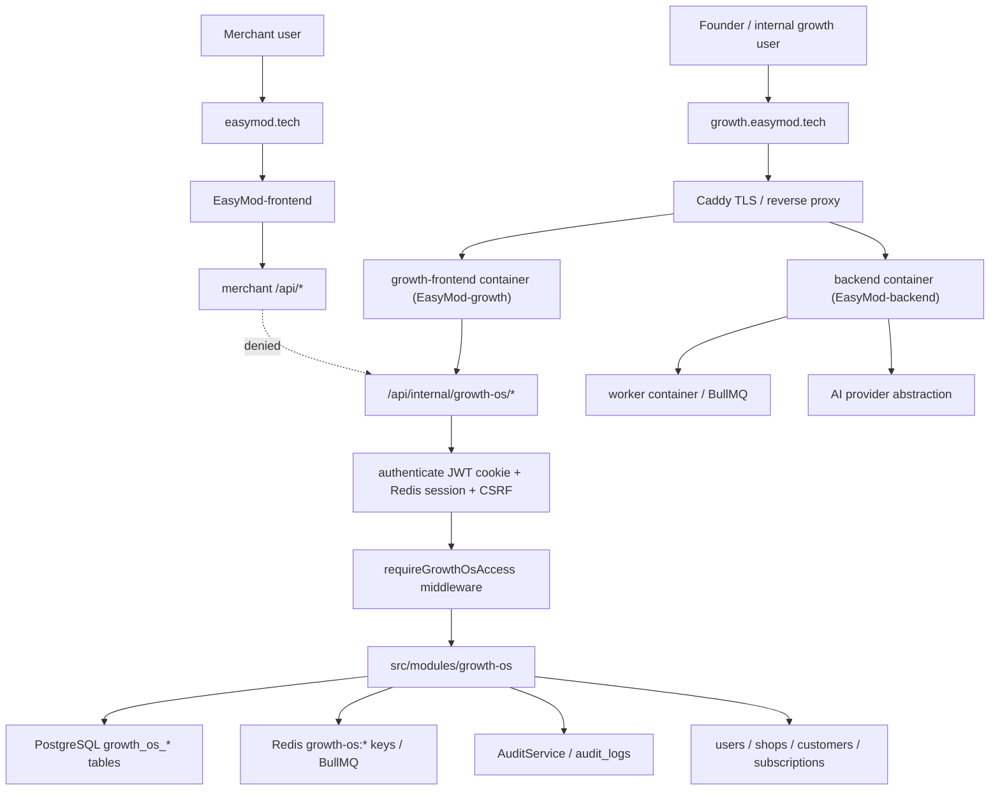

# Growth OS Architecture, Deployment, and Security Audit

Date: 2026-07-18
Status: Prompt 1 audit only
Verdict: CONDITIONAL GO for the foundation prompt

This audit is based on the current EasyModerator repository. It does not create a Growth OS app, route, migration, role, API, frontend page, production routing rule, or deployment change.

## Executive Summary

Growth OS can be introduced without putting it inside the merchant dashboard if it is implemented as a sibling frontend application and a dedicated backend module namespace inside the existing Express backend.

Recommended approach:

- Frontend: create a new sibling app at `EasyMod-growth/`, independently buildable and deployable.
- Backend: create `EasyMod-backend/src/modules/growth-os/` and mount it under `/api/internal/growth-os/*`.
- Auth: reuse existing JWT/httpOnly-cookie authentication, Redis session, CSRF, and `/api/auth/*` flows, but add an explicit Growth OS access table and middleware. Do not grant access merely from `users.platform_role`, merchant `user_shops.role`, or `/admin` frontend access.
- Deployment: add a separate `growth-frontend` Docker image/container served by Caddy at `growth.easymod.tech`, proxying `/api/*` to the same backend service.
- Data: add dedicated `growth_os_*` tables for prospects, activities, assignments, demos, tasks, scoring, referrals, testimonials, and configuration. Reference existing `users`, `shops`, `customers`, and `subscriptions` instead of copying merchant source-of-truth data.

The safest sequence is audit -> app/access skeleton -> prospect/lead module -> activities/tasks -> demos -> trials -> scoring -> executive workspace -> command center -> outreach copilot -> referral/testimonial -> final security audit.

## Evidence Inspected

Repository and deployment:

- `README.md`
- `Caddyfile`
- `docker-compose.prod.yml`
- `.env.prod.example`
- `.github/workflows/ci-cd.yml`
- `.github/workflows/grant-platform-admin.yml`
- `EasyMod-backend/package.json`
- `EasyMod-backend/Dockerfile`
- `EasyMod-frontend/package.json`
- `EasyMod-frontend/Dockerfile`
- `EasyMod-frontend/nginx.conf`
- `EasyMod-frontend/vite.config.ts`
- `EasyMod-frontend/vitest.config.js`

Backend:

- `EasyMod-backend/server.js`
- `EasyMod-backend/src/app.js`
- `EasyMod-backend/src/config/config.js`
- `EasyMod-backend/src/modules/routes.js`
- `EasyMod-backend/src/modules/entities.js`
- `EasyMod-backend/src/modules/auth/auth.controller.js`
- `EasyMod-backend/src/modules/auth/auth.service.js`
- `EasyMod-backend/src/middleware/auth.middleware.js`
- `EasyMod-backend/src/middleware/platform-admin.middleware.js`
- `EasyMod-backend/src/middleware/session.middleware.js`
- `EasyMod-backend/src/middleware/csrf-middleware.js`
- `EasyMod-backend/src/utils/auth-cookies.js`
- `EasyMod-backend/src/utils/jwt.util.js`
- `EasyMod-backend/src/utils/cache.service.js`
- `EasyMod-backend/src/utils/AppError.js`
- `EasyMod-backend/src/database/migrate.js`
- `EasyMod-backend/src/database/migrations/20260609_001_add_user_platform_role.js`
- `EasyMod-backend/src/modules/admin/admin.routes.js`
- `EasyMod-backend/src/modules/admin/admin.service.js`
- `EasyMod-backend/src/modules/admin/admin.controller.js`
- `EasyMod-backend/src/modules/audit/audit.service.js`
- `EasyMod-backend/src/modules/audit/audit-log.entity.js`
- `EasyMod-backend/src/modules/user/user.entity.js`
- `EasyMod-backend/src/modules/user-shop/user-shop.entity.js`
- `EasyMod-backend/src/modules/shop/shop.entity.js`
- `EasyMod-backend/src/modules/subscription/subscription.entity.js`
- `EasyMod-backend/src/jobs/queue-manager.js`
- `EasyMod-backend/src/jobs/worker.js`
- `EasyMod-backend/src/modules/ai/llm.service.js`

Frontend:

- `EasyMod-frontend/src/app/routes.ts`
- `EasyMod-frontend/src/app/lib/auth.ts`
- `EasyMod-frontend/src/app/lib/config.ts`
- `EasyMod-frontend/src/features/auth/AuthProvider.tsx`
- `EasyMod-frontend/src/shared/lib/http/client.ts`
- `EasyMod-frontend/src/shared/lib/auth/useIsPlatformAdmin.ts`
- `EasyMod-frontend/src/shared/components/guards/PlatformAdminRoute.tsx`
- `EasyMod-frontend/src/api/index.ts`
- `EasyMod-frontend/src/api/domains/admin.ts`
- `EasyMod-frontend/src/app/components/admin/*`

Existing admin design docs:

- `docs/superpowers/specs/2026-06-09-admin-panel-phase1-design.md`
- `docs/superpowers/plans/2026-06-09-admin-panel-phase1.md`

## Current Repository Structure

The repository is a multi-application repository, but not a formal npm workspace:

```text
easy-moderator/
  EasyMod-backend/       Express API, Sequelize models/migrations, worker code
  EasyMod-frontend/      React/Vite merchant SPA and current internal admin section
  docs/                  launch, app review, audit, and planning documents
  Caddyfile              production reverse proxy
  docker-compose.prod.yml
  .github/workflows/     CI/CD and admin role grant workflow
```

Backend location: `EasyMod-backend/`.

Merchant frontend location: `EasyMod-frontend/`.

Build tooling:

- Backend: Node 20, Express, Sequelize, Jest.
- Frontend: React 18, Vite 6, TypeScript, Tailwind 4, Vitest, Playwright.
- No root `package.json` or workspace tooling was found.

Existing internal/admin frontend:

- The merchant SPA already includes `/admin` routes in `EasyMod-frontend/src/app/routes.ts`.
- Those routes are behind `PlatformAdminRoute`, but they still live inside the merchant frontend package and runtime.
- Growth OS must not follow this pattern, because the locked context requires a dedicated internal frontend, not merchant-dashboard routes.

## Recommended Repository Structure

Create a sibling frontend app:

```text
easy-moderator/
  EasyMod-backend/
    src/modules/growth-os/
      growth-os.routes.js
      growth-os.controller.js
      growth-os.service.js
      growth-os.repository.js
      growth-os.permissions.js
      __tests__/
  EasyMod-frontend/
  EasyMod-growth/
    package.json
    Dockerfile
    nginx.conf
    vite.config.ts
    src/
      app/
      api/
      shared/
      styles/
```

Why this is safest:

- It keeps Growth OS out of `EasyMod-frontend/src/app/routes.ts`, avoiding merchant navigation and router coupling.
- It matches the existing sibling app shape (`EasyMod-backend`, `EasyMod-frontend`) better than introducing a root workspace during a near-launch period.
- It allows independent Docker image, build command, health check, CSP, and deployment target for `growth.easymod.tech`.
- It can still copy or later extract shared primitives from the merchant frontend without a runtime dependency on the merchant router.

Options rejected:

- Add Growth OS routes under `EasyMod-frontend`: rejected because it violates the locked deployment boundary.
- Create a separate backend: rejected because the prompt requires reusing the existing backend.
- Introduce a full monorepo/workspace first: too much tooling risk during launch; can be Phase 2 after the app boundary is stable.

## Architecture Diagram



## Dependency Map

```text
Growth OS frontend
  -> /api/auth/signin, /api/auth/me, /api/auth/logout, /api/csrf
  -> /api/internal/growth-os/session
  -> future /api/internal/growth-os/prospects, tasks, demos, trials

Growth OS backend module
  -> authenticate middleware
  -> new requireGrowthOsAccess middleware
  -> User model for internal identity
  -> new growth_os_user_roles / permissions
  -> AuditService.logOperation for mutations
  -> Sequelize models and migrations
  -> Redis cache and BullMQ queues for internal reminders/scheduled jobs
  -> existing Shop, Customer, Subscription, Message, Order, MetaChannel as referenced data
  -> llm.service.js only for human-reviewed outreach drafts, not scoring
```

## Backend Reuse Audit

Reusable directly:

- Authentication token verification: `auth.middleware.js` reads Bearer tokens or `access_token` httpOnly cookie, verifies JWT, checks blacklist, and populates `req.user`.
- Session/CSRF foundation: `session.middleware.js` uses Redis in production; `csrf-middleware.js` protects non-safe methods except webhooks/auth/health.
- Audit logging: `AuditService.logOperation` writes to `audit_logs` with user, shop, action, resource type, resource id, before/after, metadata, IP, and user agent.
- Migration runner: `src/database/migrate.js` auto-discovers idempotent migrations with `up` and `down`.
- Error shape: `AppError` and `globalErrorHandler` provide sanitized error responses.
- Redis cache: `cache.service.js` supports raw and tenant-scoped keys; Growth OS should use explicit `growth-os:*` keys, not shop tenant keys unless tied to a shop.
- Queue infrastructure: `queue-manager.js` uses BullMQ, recurring schedules, DLQ retention, worker process split.
- AI provider abstraction: `ai/llm.service.js` has Gemini/OpenAI failover and circuit breaker support.
- Admin read patterns: `admin.service.js` shows paginated `findAndCountAll`, filtered audit reads, and safe omission of encrypted channel tokens.

Requires adapters or new guards:

- Authorization: `platform-admin.middleware.js` supports only `SUPPORT_ADMIN` and `SUPER_ADMIN`. Growth OS needs Founder, Growth Manager, Executive, Marketer, Customer Success, and optional Analyst scopes. Do not overload `platform_role`.
- Auth context: `/api/auth/me` is merchant-shop oriented and returns `currentShop` / `allShops`. Growth OS needs a safe internal session response that omits merchant secrets and does not require merchant shop access.
- Shop permissions: `user_shops.role` is tenant/merchant scope only. It must not authorize Growth OS.
- Admin frontend route guard: `PlatformAdminRoute` is UX only and lives in the merchant frontend. Growth OS needs its own frontend guard backed by server enforcement.
- Analytics: existing analytics modules are shop/customer-message focused. Growth OS acquisition metrics need dedicated event definitions and should reference existing usage data.
- Validation: existing modules use mixed express-validator and custom validation. Growth OS should standardize on explicit validators per endpoint and reject unknown fields.

Do not reuse for authorization:

- `requireShop.middleware.js`
- `shop-access.middleware.js`
- `shop-permission.middleware.js`
- frontend `AdminRoute`
- merchant `currentShop.role`
- `x-shop-id`
- `x-admin-key` style static headers

## Authentication Flow

Current state:

- Signin/signup set `access_token` and `refresh_token` httpOnly cookies via `utils/auth-cookies.js`.
- Access cookie path is `/`; refresh cookie path is `/api/auth`.
- Production cookie `SameSite` is `none` and `secure` is true.
- `resolveCookieDomain(req)` only applies `COOKIE_DOMAIN` when the request host matches the configured domain.
- `/api/auth/refresh` accepts refresh token from cookie only.
- CSRF token is available at `/api/csrf`.
- Production CORS requires `CORS_ORIGINS`.

Recommended Growth OS flow:

1. User opens `https://growth.easymod.tech`.
2. Growth frontend calls `GET /api/internal/growth-os/session`.
3. Backend runs `authenticate`.
4. Backend runs `requireGrowthOsAccess`.
5. Middleware loads explicit Growth OS role from `growth_os_user_roles` or equivalent.
6. Response returns only: internal user id, display name, Growth OS role, permissions.
7. If unauthenticated, return 401 or reuse established signin flow.
8. If authenticated but not Growth OS authorized, return 403 and audit the denial at a rate-limited level if useful.

Cookie/subdomain decision:

- If Caddy serves `/api/*` on `growth.easymod.tech`, same-origin API calls can use host-only cookies for growth.
- If cookies must work across `easymod.tech` and `growth.easymod.tech`, `COOKIE_DOMAIN=easymod.tech` can share cookies, but this increases blast radius and requires explicit CSRF/CORS review.
- Safer Phase 1 default: keep Growth OS API same-origin at `growth.easymod.tech/api/*`, add `https://growth.easymod.tech` to `CORS_ORIGINS`, and verify cookie behavior with real browser tests before deploying.

## Authorization Model

Do not use `users.platform_role` alone for Growth OS. It represents EasyModerator operations admin access and has only two roles. Growth OS needs more granular lifecycle scopes.

Recommended dedicated table:

```text
growth_os_user_roles
  id uuid pk
  user_id uuid fk users.id
  role varchar(32)
  is_active boolean
  granted_by uuid fk users.id
  granted_at timestamptz
  revoked_by uuid nullable
  revoked_at timestamptz nullable
  metadata jsonb
  created_at timestamptz
  updated_at timestamptz
```

Recommended role names:

- `FOUNDER`
- `GROWTH_MANAGER`
- `BUSINESS_EXECUTIVE`
- `MARKETER`
- `CUSTOMER_SUCCESS`
- `READ_ONLY_ANALYST`

Access is denied by default. A merchant owner with `user_shops.role='owner'` and no active Growth OS role receives 403.

## Authorization Matrix

| Capability | Founder | Growth Manager | Executive | Marketer | Customer Success | Analyst |
| --- | --- | --- | --- | --- | --- | --- |
| View command center | yes | yes | limited | limited marketing cards | limited CS cards | aggregate only |
| Manage Growth OS roles | yes | no | no | no | no | no |
| Manage configuration | yes | limited non-security config | no | no | no | no |
| Create prospects | yes | yes | assigned scope | yes | no by default | no |
| View all prospects | yes | yes | no | campaign/source scope | no by default | aggregate only |
| View assigned prospects | yes | yes | yes | yes if source-owned | no by default | read only if granted |
| Assign/reassign owner | yes | yes | no | no | no | no |
| Add activities/notes | yes | yes | assigned only | permitted campaign records | permitted CS records | no |
| Schedule demos | yes | yes | assigned only | no by default | no by default | no |
| Manage trial interventions | yes | yes | assigned relevant trials | no | yes | read only |
| View customer health | yes | yes | assigned conversions | no by default | yes | aggregate/sanitized |
| View sensitive notes | yes | yes | assigned only | limited | limited CS only | no by default |
| Run exports | yes | limited, audited | no | campaign lists only if approved | no | aggregate only |
| Generate AI outreach drafts | yes | yes | assigned records | campaign records | CS records | no |
| Send external outreach | no automatic sending in Phase 1 | no automatic sending | no automatic sending | no automatic sending | no automatic sending | no |

Scope rule:

- Founder and Growth Manager can see team-wide data.
- Executive sees assigned records and tasks.
- Marketer sees acquisition/campaign/source records.
- Customer Success sees activated trials, health, retention, referral, and testimonial work.
- Analyst sees read-only aggregate data unless explicitly elevated.

## API Namespace

Use:

```text
/api/internal/growth-os/*
```

Initial foundation:

```text
GET /api/internal/growth-os/session
```

Future modules:

```text
GET    /api/internal/growth-os/prospects
POST   /api/internal/growth-os/prospects
GET    /api/internal/growth-os/prospects/:id
PATCH  /api/internal/growth-os/prospects/:id
POST   /api/internal/growth-os/prospects/:id/assign
POST   /api/internal/growth-os/prospects/:id/status-transition
POST   /api/internal/growth-os/prospects/:id/convert-to-lead
POST   /api/internal/growth-os/prospects/:id/link-shop
GET    /api/internal/growth-os/tasks
POST   /api/internal/growth-os/tasks
GET    /api/internal/growth-os/demos
GET    /api/internal/growth-os/trials
GET    /api/internal/growth-os/command-center
POST   /api/internal/growth-os/outreach-drafts
```

API conventions:

- Authenticate every route except no public Growth OS route.
- Authorize every route server-side.
- Use page/limit with max caps or cursor pagination for high-volume tables.
- Use filtering allowlists, not raw query passthrough.
- Use deterministic status transition services.
- Audit every create/update/delete/assignment/status/role/export/action-draft mutation.
- Return standard success envelopes consistent with the repo where practical.
- Return 401 for unauthenticated, 403 for authenticated but unauthorized, 404 without leaking object existence where scope is insufficient.

## Data Model

Recommended dedicated tables:

- `growth_os_user_roles`
- `growth_os_prospects`
- `growth_os_prospect_contacts`
- `growth_os_acquisition_sources`
- `growth_os_lead_activities`
- `growth_os_notes`
- `growth_os_follow_up_tasks`
- `growth_os_demo_sessions`
- `growth_os_lead_assignments`
- `growth_os_scoring_snapshots`
- `growth_os_trial_interventions`
- `growth_os_customer_health_assessments`
- `growth_os_referrals`
- `growth_os_testimonials`
- `growth_os_outreach_drafts`
- `growth_os_config`

Reference existing tables instead of duplicating:

- `users`: internal actors, assignees, creators, presenters.
- `shops`: linked merchant shop after trial/account creation.
- `customers`: existing customer identity where relevant.
- `subscriptions`: trial/payment/conversion status.
- `meta_channels`: Facebook Page connection status.
- `products`, `faq_responses`, `messages`, `orders`: activation signals.
- `audit_logs`: mutation trail.

Do not copy:

- shop profile source-of-truth
- billing state
- subscription status
- product state
- message content beyond necessary references/summaries
- encrypted channel tokens
- payment credentials
- courier credentials

Core prospect fields:

```text
business_name, contact_person, phone, email, facebook_page_url, website_url,
business_category, location, district, preferred_language, acquisition_source_id,
status, assigned_user_id, estimated_monthly_messenger_conversations,
estimated_monthly_orders, current_selling_process, current_courier,
current_automation_tool, pain_points, qualification_notes, next_follow_up_at,
created_by, updated_by, lost_reason, not_suitable_reason, linked_shop_id,
linked_customer_id
```

Indexes to plan:

- normalized Facebook Page URL unique/lookup
- normalized phone lookup
- normalized email lookup
- status + assigned_user_id
- next_follow_up_at
- linked_shop_id
- acquisition_source_id
- created_at

## Deployment Design

Current deployment:

- Caddy serves `easymod.tech`.
- `/api/*`, `/uploads/*`, and webhook paths proxy to `backend:3000`.
- Everything else proxies to `frontend:8080`.
- Docker Compose runs `caddy`, `backend`, `worker`, `frontend`, `postgres`, `redis`, and `qdrant`.
- CI/CD builds backend and frontend images, pushes to GHCR, SSHes to the droplet, runs Compose, runs migrations, and verifies backend `/health/ready`.

Recommended Growth OS deployment:

1. DNS: create `A`/`CNAME` for `growth.easymod.tech` to the same droplet.
2. Caddy: add a new site block for `growth.easymod.tech`.
3. Service: add `growth-frontend` container from a new GHCR image.
4. Routing:
   - `growth.easymod.tech/api/*` -> `backend:3000`
   - `growth.easymod.tech/health` -> growth frontend nginx health
   - everything else -> `growth-frontend:8080`
5. TLS: let Caddy manage certificate for the subdomain.
6. Backend CORS: add `https://growth.easymod.tech` to `CORS_ORIGINS` if cross-origin calls exist. Prefer same-origin through Caddy.
7. CSRF: ensure `/api/csrf` works from growth origin and mutation requests include `X-CSRF-Token`.
8. CSP: create a Growth OS CSP narrower than merchant frontend. It likely does not need Meta OAuth frame/script domains in Phase 1.
9. Health: add frontend health endpoint and include it in CI/CD deploy verification.
10. Rollback: keep previous growth frontend image tag and deploy by retagging or Compose env override. Backend migrations must be backward-compatible.

Do not alter production DNS or Caddy until the foundation prompt explicitly performs deployment preparation.

## CI/CD Design

Current `.github/workflows/ci-cd.yml` filters only backend/frontend paths and builds two GHCR images.

Required CI additions later:

- Add path filter for `EasyMod-growth/**`.
- Add test/build job for Growth OS frontend.
- Add GHCR image `easymod-growth`.
- Add Compose env `GHCR_IMAGE_GROWTH`.
- Add deploy pull/tag for growth image.
- Add health verification for `growth-frontend`.
- Keep merchant frontend build path unchanged.

The deployment should not block merchant-only deploys on Growth OS tests unless shared files or backend Growth OS code changed.

## Security Threat Review

Merchant account accessing Growth OS:

- Risk: high.
- Control: server-side `requireGrowthOsAccess` backed by explicit `growth_os_user_roles`; deny by default; tests for merchant owner denied.

Executive viewing another executive's records:

- Risk: high.
- Control: record ownership filters in repository layer; managers/founder only for team-wide data; IDOR tests.

IDOR:

- Risk: high.
- Control: every `:id` lookup must include authorization scope; return 404/403 without sensitive details.

Leaking internal notes:

- Risk: high.
- Control: role-based field serializer; analyst and marketer views exclude sensitive notes unless explicitly justified.

Unsafe subdomain cookies:

- Risk: medium/high.
- Control: verify `COOKIE_DOMAIN`, SameSite, Secure, CSRF, and CORS with browser tests; prefer same-origin API at growth host.

Permissive CORS:

- Risk: high.
- Control: production already requires `CORS_ORIGINS`; add only exact `https://growth.easymod.tech`, never wildcard.

Frontend-only access control:

- Risk: high.
- Control: backend guard on every endpoint; frontend guards are UX only.

Privilege escalation:

- Risk: high.
- Control: only Founder can grant/revoke Growth OS roles; audit all role changes; invalidate role cache immediately.

Bulk export misuse:

- Risk: medium/high.
- Control: defer exports or make founder-only, rate-limited, audited, with reason required.

AI prompt data leakage:

- Risk: medium/high.
- Control: use only verified stored data for drafts; no hidden sensitive notes in prompts unless user role allows and draft target justifies it; log metadata, not full prompts when sensitive.

Audit-log bypass:

- Risk: medium.
- Control: mutation service wrapper requiring audit metadata; tests assert audit calls.

Impersonation:

- Risk: high.
- Control: do not add impersonation in Phase 1; if ever added, make founder-only, time-limited, highly visible, and separately audited.

Unauthorized API discovery:

- Risk: medium.
- Control: all routes return 401/403 and no sensitive route metadata; keep internal docs out of public frontend assets.

## Launch Risk

Meta App Review:

- Low risk if Growth OS does not add external messaging, scraping, auto-send, comment automation, or merchant-facing claims.
- Medium risk if Outreach Copilot later touches Messenger policy. Keep draft-only and manual-send in Phase 1.

Merchant frontend deployment:

- Medium risk if Growth OS is added inside `EasyMod-frontend`.
- Low risk with sibling `EasyMod-growth` and separate Caddy host.

Messenger webhooks:

- Low risk if no webhook routes change.
- Do not touch `/api/webhooks/meta`, Meta OAuth, or channel provider paths during Prompt 2.

Billing/onboarding/orders:

- Low to medium risk if Growth OS only references existing data.
- High risk if it mutates subscriptions or shop setup directly. Trial monitoring should read signals and create internal tasks, not rewrite merchant setup state.

Production resource usage:

- Medium risk. New dashboards can cause heavy cross-shop queries. Use pagination, indexes, cached aggregates, and background rollups for command-center metrics.

Migration safety:

- Medium risk. New tables are additive and should be backward-compatible. Avoid altering existing merchant tables except explicit foreign-key references if necessary.

CI duration:

- Medium risk. A new frontend build adds time. Use path filters so merchant-only changes are not forced through Growth OS build unless shared/backend files changed.

Droplet capacity:

- Medium risk. A new nginx container is low cost, but backend analytics queries and BullMQ tasks can add load. Start with small polling and no heavy scheduled scans.

## Migration Strategy

Rules:

- Additive migrations only in Phase 1.
- Every migration has `up` and `down`.
- Use `growth_os_` prefix for all tables and indexes.
- Use `VARCHAR` plus code validation for role/status enums unless the repo standard changes; existing admin migration avoided DB ENUM friction.
- Create indexes with `IF NOT EXISTS`.
- Do not backfill large existing merchant tables.
- Do not add non-null FKs to existing populated tables.

Foundation migration sequence:

1. `growth_os_user_roles`
2. `growth_os_config`
3. Later module tables in prompt order.

Rollback:

- Drop new Growth OS tables in reverse dependency order.
- Do not delete or mutate merchant data.
- Keep backend code tolerant of missing Growth OS rows by denying access.

## Test Strategy

Prompt 2 minimum tests:

- `GET /api/internal/growth-os/session` returns 401 unauthenticated.
- Merchant owner without Growth OS role returns 403.
- Platform admin without Growth OS role returns 403 unless explicitly granted.
- Founder role returns allowed role and permissions.
- Executive role returns limited permissions.
- Backend denial remains even if frontend route guard is bypassed.
- CSRF required for Growth OS mutations.
- CORS/cookie behavior verified in browser for `growth.easymod.tech`.

Ongoing tests:

- Authorization matrix tests per endpoint.
- IDOR tests for every `:id`.
- Field redaction tests for notes and sensitive internal data.
- Audit tests for all mutations.
- Migration up/down tests.
- Frontend build and route guard tests.
- Merchant frontend build to prove no dashboard regression.

Manual smoke:

1. Authorized founder opens Growth OS and sees shell.
2. Merchant user opens Growth OS and gets access denied.
3. Unauthenticated user gets signin/auth flow.
4. Merchant dashboard routes under `easymod.tech` are unchanged.

## Rollout Plan

1. Prompt 1: audit document only. Complete in this file.
2. Prompt 2: app skeleton and backend access boundary, no business modules.
3. Deploy to staging or local dev first.
4. Verify authorized/unauthorized behavior manually.
5. Add production Caddy/Compose/CI support.
6. Deploy production only after merchant app smoke passes.
7. Continue module prompts only after founder acceptance rule is satisfied.

## Rollback Plan

Frontend rollback:

- Remove or disable Caddy `growth.easymod.tech` site block.
- Stop `growth-frontend` service.
- Retag previous `easymod-growth` image or deploy prior Compose config.

Backend rollback:

- Disable `/api/internal/growth-os` route mount if needed.
- Revert backend code.
- Run migration down only if no production Growth OS data must be retained.

Operational fallback:

- Set a feature flag such as `GROWTH_OS_ENABLED=false` so backend returns 503/404 for Growth OS namespace without affecting merchant APIs.
- Keep merchant `easymod.tech` Caddy routes untouched.

## Explicit Do-Not-Build List

Do not build in Phase 1 foundation:

- merchant dashboard Growth OS pages
- merchant navigation entries
- separate backend
- Facebook scraping
- mass messaging
- auto-send Messenger/WhatsApp/email
- workflow builder
- generic CRM features not tied to acquisition/activation/retention
- duplicated shop/billing/customer source-of-truth
- permission inferred from merchant owner/admin/staff role
- permission inferred from frontend route guard
- broad export tools
- impersonation
- public SaaS Growth OS signup

## Implementation Sequence

Prompt 2 should do only:

1. Read this audit.
2. Verify repo state is still consistent.
3. Create or confirm branch.
4. Add `EasyMod-growth/` skeleton.
5. Add backend `growth-os` namespace.
6. Add explicit Growth OS role/permission model.
7. Add `GET /api/internal/growth-os/session`.
8. Add server-side authorization tests.
9. Prepare deployment docs/config without blindly changing production DNS.
10. Write `docs/growth-os/02-application-foundation.md`.

Prompt 3 and later should not start until Prompt 2 acceptance passes.

## Unresolved Questions

- Should Growth OS share the exact same signin page/API as merchants, or should `growth.easymod.tech` have an internal-only signin screen that calls the same auth endpoints?
- Should `COOKIE_DOMAIN=easymod.tech` be used for shared sessions across apex and growth subdomain, or should Growth OS prefer host-only cookies through same-origin proxying?
- Which production user should receive the first `FOUNDER` Growth OS role?
- Should Growth OS role assignment be managed through GitHub Actions like `grant-platform-admin.yml`, or only through a Founder UI after bootstrap?
- What is the expected daily prospect/task volume for indexing and query planning?
- Should Analyst exist in Phase 1, or be deferred until reports/exports exist?

## Verdict

CONDITIONAL GO for Prompt 2.

Conditions:

- Keep Growth OS frontend as a sibling app, not inside merchant `EasyMod-frontend`.
- Add explicit Growth OS access control; do not reuse merchant roles or rely only on `platform_role`.
- Keep all APIs under `/api/internal/growth-os/*`.
- Make all schema changes additive and namespaced.
- Do not touch Meta webhooks, merchant navigation, onboarding, billing mutations, or production DNS in the foundation step.
- Verify merchant dashboard remains unchanged before moving to Prompt 3.

## Proof Of Delivery

After this prompt, no visible Growth OS application exists. The only deliverable is this audit document.
