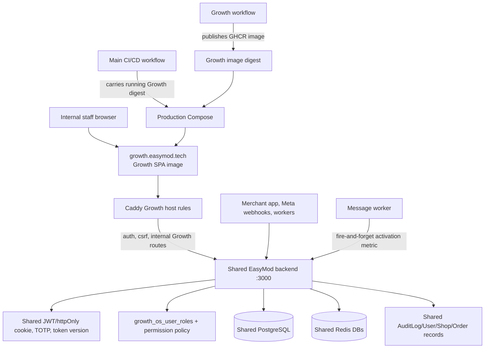

# EasyModerator Growth OS Current-State Audit

Audit date: 2026-09-13

GROWTH_OS_AUDIT_STATUS=COMPLETE
AUDIT_BRANCH=audit/growth-os-current-state-2026-09-13
AUDIT_BASE_SHA=77790a833da372a03899686a365d7a40b2a95a67
ORIGINAL_WORKTREE_UNCHANGED=true

PRODUCTION_MUTATED=NO
PRODUCTION_DEPLOYMENT_TRIGGERED=NO
PRODUCTION_DB_MUTATED=NO
PRODUCTION_CONFIG_MUTATED=NO
META_REVIEW_APP_CHANGED=NO

CURRENT_CLASSIFICATION=PARTIALLY_FUNCTIONAL

## 1. Executive Summary

Growth OS is a live, internal-only staff surface with a real separate frontend
image/host and a shared EasyModerator backend. The implemented business slice is
the Phase 3 prospect ledger: authenticated prospect discovery by staff, duplicate
preflight, create/edit, lifecycle transition, assignment, linkage to existing
users/shops, timeline, merge tombstones, and a dry-run-by-default historical
importer.

It is not yet a complete acquisition, activation, and retention operating system.
The Growth frontend has only an overview shell and prospect routes. The overview
is static and does not consume the backend growth metrics endpoint. There is no
implemented discovery provider, enrichment, scoring, campaign, outreach, reply,
qualified/converted lifecycle, task, demo, trial, referral, churn, or customer
health workflow. The API permission map contains several future capabilities that
have no corresponding route or UI.

Current live evidence is better than the historical August state documents:

- `https://growth.easymod.tech/health` returned `{"status":"ok","service":"growth-os"}`.
- `https://growth.easymod.tech/health/ready` returned `{"status":"ready","service":"growth-os"}`.
- `https://growth.easymod.tech/build-info.json` reports build metadata SHA
  `e455b0c69ce8aca1a18d7dc4085f1cd6854d25d0`.
- `https://api.easymod.tech/health/ready` reports backend commit
  `77790a833da372a03899686a365d7a40b2a95a67`, PostgreSQL connected, and Redis
  connected.
- Unauthenticated Growth session and prospect requests return `401`; the Growth
  host returns `404` for the non-proxied `/api/analytics/growth` route.

The latest published Growth image is newer than the live Growth build metadata:
the latest successful Growth workflow published build SHA
`63d70c3c50d92fcfce8f7e07ca2b3e7935f49412` with digest
`sha256:3337ddc7fe632afdbaf1caea81d2e91c24bcd70f3d7239a242f4183302534a2e`.
The main deployment carries the running Growth digest forward and does not
consume the latest Growth publication unless an explicit bootstrap digest is
provided. A published image is therefore not evidence that the image is deployed.

The exact classification is `PARTIALLY_FUNCTIONAL`, not `PRODUCTION_READY`:

- bounded code, integration tests, and historical remote browser evidence exist;
- live health and the unauthenticated security boundary are currently proven;
- the authenticated live business workflow and operator bootstrap are not proven;
- the intended full-funnel business outcome is materially incomplete;
- local validation could not execute in the fresh audit worktree because
  dependencies and Docker were unavailable;
- Growth is coupled to the main backend, PostgreSQL, Redis, migration runner,
  shared deployment, and merchant worker paths.

## 2. Evidence & Method

### Scope and isolation

The original repository was discovered at `D:\easymod\easy-moderator`, not at
the parent scratch directory. It had a pre-existing dirty branch and was not
modified. After `git fetch origin --prune`, this audit used a separate worktree:

```text
AUDIT_WORKTREE=D:\easymod\easymoderator-growth-os-audit
AUDIT_BRANCH=audit/growth-os-current-state-2026-09-13
AUDIT_BASE_SHA=77790a833da372a03899686a365d7a40b2a95a67
```

Only this audit document is created by this task. No application source,
existing documentation, environment variable, secret, image, service, database,
Redis instance, Qdrant collection, Meta configuration, or production host was
modified.

### Evidence hierarchy

Evidence was weighted in this order:

1. Current executable source and configuration at the audit base SHA.
2. Read-only GitHub Actions run metadata and logs.
3. Read-only public health/build endpoints.
4. Current tests and test harnesses.
5. Git history, merged PRs, and dated Growth documents.
6. Historical plans and claims that are not backed by current code.

The following skills were loaded as engineering guidance: Spec Miner first,
Architecture Designer, Fullstack Guardian, JavaScript Pro, TypeScript Pro,
React Expert, API Designer, PostgreSQL Pro, Database Optimizer, Test Master,
Playwright Expert, Code Reviewer, Secure Code Guardian, Security Reviewer,
DevOps Engineer, Monitoring Expert, SRE Engineer, and The Fool. Their guidance
was applied without copying or vendoring the skill repository.

Parallel read-only lanes were assigned for architecture/spec mining, frontend,
backend/data, QA/E2E, security, DevOps/SRE, business value, and adversarial
architecture challenge. The lead reconciliation below uses repository and
runtime evidence, not historical agent claims.

### Safety boundary

No SSH was used. No production database or Redis connection was opened. Public
GET health/build requests were the only runtime checks. GitHub CLI use was
read-only. The pre-existing production deployment described in section 13 was
not triggered by this audit.

## 3. Git / PR / SHA State

### Worktrees and branches

| Item | Evidence | State |
| --- | --- | --- |
| Original repository | `D:\easymod\easy-moderator` | Pre-existing dirty worktree left untouched |
| Original branch | `feat/shuru-growth-partner-commercial-model` | Existing branch, shown as gone upstream; not changed |
| Audit branch | `audit/growth-os-current-state-2026-09-13` | Created from `origin/main` |
| Audit base | `77790a833da372a03899686a365d7a40b2a95a67` | Clean at creation |
| Growth source tip | `c65919238b608b5329aa0c152be4387dbafbfb67` | Latest commit touching `EasyMod-growth` on current main |
| Growth source delta | `git diff c659192..77790a8 -- EasyMod-growth` | Empty; current main changes after the Growth source tip do not change Growth source |

The original worktree status captured immediately after worktree creation and
again before this report was identical. The audit worktree remained clean until
this document was added.

### Growth-related PR archaeology

Read-only GitHub PR history shows the Growth work was delivered in phases rather
than as one complete product. Relevant merged work includes PRs `#34`, `#35`,
`#37`, `#39`, `#40`, `#42`, `#44`, and `#46`. The latest Growth-related search
returned no open Growth PR. The sequence separates:

- Phase 1 telemetry/idempotency and analytics foundations.
- Phase 2 authentication, Growth roles, MFA assurance, and internal APIs.
- Phase 3 prospect ledger and its hardening.
- Later release-safety, rollback-rehearsal, and publication work.

The historical intent in `docs/growth-os/GROWTH_OS_GOAL.md` is a full internal
acquisition/activation/retention OS, but the current source remains the bounded
prospect foundation described in `docs/growth-os/04-prospect-foundation.md`.

## 4. Growth OS Architecture



### Isolation answer

Growth is partially separated, not an independent backend service:

- Separate frontend source directory: `EasyMod-growth`.
- Separate frontend Docker image and GHCR publication workflow.
- Separate public host: `growth.easymod.tech`.
- Shared backend process and runtime image with the merchant application.
- Shared PostgreSQL database and migration runner.
- Shared Redis infrastructure, with Growth-specific key prefixes and cache DB
  conventions but no independently operated Redis service.
- Shared authentication, users, shops, orders, audit log, Caddy, Compose, and
  production deployment workflow.
- No Growth-specific queue, scheduler, external provider, browser automation
  service, Qdrant collection, Meta webhook, or outreach provider is currently
  used by the Growth surface.

The separation is appropriate for a small internal tool, but the documentation
overstates isolation. The frontend is independently publishable; the business
runtime is not independently deployable or failure-isolated.

### Dependency and blast-radius map

| Growth dependency | Type | Why it exists | Failure behavior | Main-app impact | Coupling |
| --- | --- | --- | --- | --- | --- |
| Shared backend process | Runtime/API | Hosts `/api/internal/growth-os` and analytics route | Growth requests fail with 5xx/503; process/resource pressure is shared | Growth traffic can consume backend CPU, connections, memory, and logs | HIGH |
| PostgreSQL | Shared relational store | Roles, prospects, events, users, shops, orders, AuditLog | Growth routes fail closed or return sanitized unavailable errors | Migrations, connection pool, locks, and bad queries affect merchant APIs | CRITICAL SHARED DEPENDENCY |
| Redis | Shared cache/rate-limit store | Growth role cache, strict authorization cache, activation NX claims | Growth auth fails closed when strict role cache is unavailable; activation bookkeeping is best effort | Redis saturation/outage affects workers, sessions, rate limits, and merchant behavior | HIGH |
| Shared JWT/session/TOTP | Authentication | Reuses canonical identity and MFA assurance | 401/403/503 as appropriate | Auth/session regressions can affect all app users | HIGH |
| User/Shop/Order entities | Merchant data | Link prospects, compute activation/retention | Data unavailable or stale | Growth can read all eligible shop/order records; activation writes Shop settings | HIGH |
| AuditLog | Audit/funnel persistence | Role changes and funnel events | Metrics/events can fail; no external outreach occurs | Shared audit table growth and transaction load | MODERATE |
| Message worker | Merchant worker integration | Records first AI reply activation | Fire-and-forget, errors swallowed after sanitized log | No reply blocking, but Growth activation data silently misses events | MODERATE |
| Caddy | Routing/TLS | Growth host and same-origin API proxy | Host/API routes return 404/5xx or TLS fails | Config reload/deploy affects all public hosts | MODERATE |
| Main CI/CD | Deployment | Deploys backend/frontend and carries Growth digest | Deploy is gated but still restarts shared stack and runs migrations | A Growth-related release path can restart merchant services | HIGH |
| Qdrant/Meta/webhooks | No current direct dependency | Not used by current Growth code | None observed | No direct Growth blast radius today | ISOLATED |

## 5. Main-App Dependency / Blast-Radius Map

| Main application surface | Current Growth relationship | Risk if Growth fails or is abused |
| --- | --- | --- |
| Messenger processing and AI replies | `message-worker.js` records activation asynchronously after a first reply | Usually no reply blockage; silent activation metric loss; shared worker/Redis pressure remains possible |
| Meta webhooks and OAuth | No direct Growth route/provider; both use shared backend/auth/deploy | A shared backend or deployment failure can affect Meta handling even without Growth code paths |
| Facebook Page connections | Growth only links a prospect to an existing shop/user; it does not create a connection | Linkage writes are sensitive but do not invoke OAuth |
| Shared Inbox | No direct Growth integration | Shared backend/database/resource pressure only |
| Product grounding/Qdrant | No direct Growth integration | No direct collection or vector-data impact found |
| Orders/customers/courier/payments | Growth metrics reads orders; prospect linkage references users/shops; no payment/courier mutation | Broad read query and shared migrations can affect main app; no direct payment mutation |
| Subscription enforcement | Explicitly not copied or mutated by prospect services | Low direct coupling; shared backend/database still matters |
| PostgreSQL | Same database and migration runner | Growth migration/query/index failure can block or slow core app deployment/data access |
| Redis | Same Redis infrastructure; Growth prefixes are not a separate service | Cache/rate-limit saturation or Redis recovery affects merchant workers and sessions |
| Workers/scheduler | Message worker calls activation bookkeeping; no Growth scheduler | Activation is best effort; shared worker code path is coupled |
| Main frontend | Separate Growth SPA and host; no shared bundled asset | Caddy/deploy configuration remains shared |

The highest-risk boundary is not a current IDOR. It is operational coupling:
Growth has its own image but the main production deployment can still restart
backend, worker, Redis, and frontend together.

## 6. Feature Inventory

Status uses the required vocabulary and is based on current code plus evidence,
not existence of a file alone.

| Feature | UI | Backend | DB | Tests | E2E | Operational | Status |
| --- | --- | --- | --- | --- | --- | --- | --- |
| Shared sign-in, session, TOTP/MFA, Growth role guard | Yes | Yes | Yes | Unit/security/integration | Historical 12/12 disposable gate; live unauth boundary only | Live health and 401 boundary | PARTIAL |
| Growth overview/dashboard | Yes | No Growth UI call | No | Basic route/render coverage | Sign-in shell only | Static SPA | UI-ONLY |
| Prospect list, search, filters, pagination | Yes | Yes | Yes | Unit/integration/frontend | Historical E2E | Runtime host exists; auth workflow not live-proven | PARTIAL |
| Prospect create/edit and duplicate preflight | Yes | Yes | Yes | Unit/security/integration | Historical E2E | Runtime host exists | PARTIAL |
| Lifecycle transitions and typed timeline | Yes | Yes | Yes | Unit/integration | Historical E2E | Runtime host exists | PARTIAL |
| Assignment/ownership | Yes | Yes | Yes | Unit/security/integration | Historical E2E | Runtime host exists | PARTIAL |
| Linkage to existing user/shop | Yes | Yes | Existing User/Shop | Unit/security/integration | Historical E2E | Runtime host exists | PARTIAL |
| Merge/tombstones | Yes | Yes | Yes | Unit/integration | Historical E2E | Runtime host exists | PARTIAL |
| Historical prospect importer | No | Script/service | Yes | Integration/import tests | No | Dry-run default; operator-only | BACKEND-ONLY |
| Growth role grant/revoke | No | Yes | Yes | Security/integration | Permission fixtures, no admin UI | Requires operator CLI/bootstrap | BACKEND-ONLY |
| Activation metric | No | Yes | `shops.settings` + Redis claim | Unit/worker tests | No live authenticated proof | Fire-and-forget in merchant worker | CODE-ONLY |
| Retention report | No | Yes | Orders/shops | Unit tests | No | Route is on main API, not Growth host | BACKEND-ONLY |
| Funnel event telemetry | No Growth UI | Yes | AuditLog | Unit/security tests | No Growth funnel journey | Shared audit event path | BACKEND-ONLY |
| Campaigns/outreach | No | No current route | No | No | No | No provider/job | DISCONNECTED |
| Enrichment/scoring/prospect discovery | No | No current route | No | No | No | No provider/job | DISCONNECTED |
| Tasks/demos/trials/customer health | No | Permission names only | No Growth tables | No feature tests | No | No runtime workflow | DEAD |
| Churn/retention automation/referrals/testimonials | No | No current route | No | No | No | No provider/job | DISCONNECTED |
| Growth image build/publish | N/A | N/A | N/A | CI verify + browser gate | CI disposable only | GHCR digest published | WORKING |
| Growth production delivery | N/A | Shared deploy | Shared Compose | CI deploy receipt | Public health only | Runtime is live, image lineage differs | PARTIAL |

## 7. User Journey State

### Journey A: staff sign-in and access

```text
/login
  -> shared /api/auth/signin and optional TOTP
  -> /api/internal/growth-os/session
  -> GrowthAuthProvider / ProtectedRoute
  -> overview or access-denied/session-expired
```

Observed controls include canonical JWT/httpOnly cookies, token-version and
revocation checks, explicit Growth roles, MFA assurance for Founder and Growth
Manager, and server-side permission middleware. Public read-only checks proved
the unauthenticated `401` boundary but did not exercise a live authorized
account, operator bootstrap, or live cookie-expiry browser flow.

### Journey B: bounded prospect ledger

```text
Prospects
  -> search/filter/page
  -> duplicate preflight
  -> create
  -> detail/timeline
  -> edit, assign, lifecycle transition
  -> linkage suggestion and deliberate user/shop link
  -> merge source into target tombstone
```

This is the only complete business-shaped journey in the current Growth UI.
Transactions, deterministic lifecycle validation, audit rows, unique identity
constraints, and the historical 12/12 disposable browser suite provide strong
development evidence. The UI intentionally does not offer `qualified` or
`converted` transition options; the E2E test asserts those options are absent.
That is a clear boundary, not a completed sales funnel.

### Journey C: historical import

```text
operator runs import-growth-prospects.js
  -> read legacy crm_lead and Partner-shaped records
  -> normalize identity/source fields
  -> duplicate preflight
  -> dry-run report or transactional create/link
```

The importer is not a scheduled job and has no UI. It reads `AuditLog` rows for
legacy `crm_lead` records even though the operating rule says not to use
`audit_logs` as the prospect source of truth. This can be acceptable as a one-off
legacy extraction, but the boundary is undocumented and currently contradicted.

### Journey D: activation and retention

The first AI reply calls `recordActivation` asynchronously. It uses a Redis
`NX` claim, then writes `shops.settings.activation.activated_at`; errors are
swallowed so merchant replies are not blocked. The report endpoint reads all
shops and grouped orders for the last two seven-day windows. There is no Growth
UI route consuming that endpoint, no conversion event, no outreach response, no
cohort retention model, and no attribution to acquisition source.

### Dead ends and unfinished actions

- The overview says `Prospect foundation ready` but is a static status panel.
- The `growth_os.reports.read_all`, campaign, task, customer-health, and
  retention permission names imply capabilities that are not navigable or
  implemented.
- A prospect can be marked only through the current legal lifecycle; there is no
  qualified/converted workflow that closes the acquisition loop.
- A successful prospect-to-merchant link is not a conversion event or onboarding
  activation event.
- The production host is healthy, but an authenticated live browser journey is
  unproven.

## 8. Frontend / UX Findings

### Engineering

- `EasyMod-growth/src/App.tsx` exposes login, overview, prospects, prospect
  create/detail/edit, access denied, session expired, and unavailable routes.
- `GrowthShell.tsx` navigation contains only `Overview` and `Prospects`.
- `DashboardPage.tsx` renders static cards and explanatory copy. It does not
  call `/api/analytics/growth`; the backend analytics route is therefore not
  represented in the Growth frontend.
- `api/client.ts` uses same-origin requests, credentials, CSRF initialization,
  bounded request timeout, refresh/retry, and explicit 401/403/503 mapping.
- `GrowthAuthProvider` and `ProtectedRoute` provide UX protection, but server
  middleware remains the authority.
- Prospect list/detail/forms have loading, error, retry, duplicate, redaction,
  and unavailable states. The E2E suite uses accessible labels and role-based
  selectors.
- Historical E2E coverage checks 390px, 768px, and 1440px layouts, no horizontal
  overflow, table width, and 44px primary hit targets.
- The frontend build is small and route scope is bounded, but the static
  overview creates a misleading impression of an operational dashboard.

### UX and business findings

- The navigation is clear for the prospect ledger but does not expose a funnel,
  campaign, conversion, activation, or retention workflow.
- `Eligible for next phase` and `Next phase` language has no implemented next
  phase action. This is a product promise without a user-completable outcome.
- There is no evidence-backed empty-state path for a new operator beyond generic
  prospect list behavior; no guided import or first-workflow activation exists.
- Mobile behavior is tested for the current ledger, not for campaigns or
  dashboards that do not exist.
- The absence of qualified/converted options is safer than allowing fake state,
  but the UI should explicitly say the current release stops at the foundation
  rather than implying a full Growth OS.

## 9. Backend / Data Findings

### Routes and contracts

The Growth router is mounted at `/api/internal/growth-os` and currently exposes:

```text
GET    /session
GET    /prospects
GET    /prospects/duplicate-check
POST   /prospects
GET    /prospects/:id
PATCH  /prospects/:id
POST   /prospects/:id/status
POST   /prospects/:id/assign
GET    /prospects/:id/linkage-suggestions
POST   /prospects/:id/link
POST   /prospects/:id/merge
```

`GET /api/analytics/growth` is a separate analytics route on the main API
router, guarded by `growth_os.reports.read_all`, and is not proxied by the
Growth host Caddy allowlist. A public GET to the Growth host returned `404`.

### Persistence and consistency

- `20260820_001_growth_os_user_roles.js` creates the role table with active and
  revoked state fields.
- `20260820_002_growth_os_prospects.js` creates the two-table prospect ledger:
  prospects and prospect events, with lifecycle checks, ownership, linkage,
  merge tombstones, and event/audit metadata.
- `20260820_003_growth_os_prospect_source_reference_idx.js` adds source-reference
  support for the importer.
- Prospect rows reference canonical EasyModerator records instead of copying
  merchant/subscription/customer data.
- Create/edit/status/assignment/link/merge operations use transactions where
  required, deterministic lifecycle checks, row locks for merge ordering, and
  partial unique identity constraints.
- Offset pagination is bounded at 100 rows and timeline pages are bounded at 100.
- Duplicate and linkage lookups have targeted Redis-backed rate limits, but not
  every read/mutation endpoint is rate limited.
- There is no Growth-specific queue, scheduler, retry worker, or webhook
  consumer. The importer is a command-line batch process.

### Correctness and data risks

- The importer loads source records in bulk and has documented unbounded source
  loads and intra-batch dry-run count limitations.
- Linkage suggestions use `%LIKE%` phone matching and exact email matching over
  `User`; this is not indexed for the current pattern.
- Prospect `q` search uses broad matching without a `pg_trgm` strategy.
- `metadata` has a 50-key cap but no explicit nested-value or total byte cap;
  the global request body limit is 35 MB. Internal roles reduce exposure but do
  not remove database bloat risk.
- Migration/entity and `db:sync` index/DDL drift is documented as deferred.
- The merge tombstone `ON DELETE SET NULL` behavior conflicts with the merge
  invariant and must be tested against deletion semantics before expanding use.
- `recordActivation` is intentionally best effort. A Redis or Shop write failure
  can silently lose activation telemetry while the merchant reply succeeds.

## 10. Security Findings

### Controls observed

- Unauthenticated public session and prospect requests return `401`.
- Backend authorization is explicit and default-deny; frontend claims do not
  authorize rows.
- Merchant users without Growth roles receive `403` and no Growth navigation in
  the disposable E2E suite.
- Marketer source scopes and redaction of private notes/timeline values are
  tested.
- Founder/Growth Manager privileged access requires the server-issued MFA claim.
- Role grant/revoke is founder-only, transactional, audited, and has a last
  founder guard.
- Prospect input uses Joi validation, UUID constraints, bounded text fields,
  allowed source/status enumerations, and reason limits.
- User-provided URLs are stored as text and are not fetched by current Growth
  code; no current SSRF path was found.
- React renders user content as text; no `dangerouslySetInnerHTML` path was
  found in the reviewed Growth pages.

### Findings and severity

| ID | Severity | Finding | Evidence and impact | Recommended direction |
| --- | --- | --- | --- | --- |
| SEC-01 | Medium | Shared backend dependency audit needs triage | `npm audit --package-lock-only --audit-level=high` reports one high `js-yaml` advisory and moderate `joi`, `morgan`, and `qs` advisories in the monorepo/backend graph. `js-yaml` is marked dev in the lockfile; runtime reachability is not proven in the clean worktree. | Resolve or explicitly accept each dependency, separate dev/runtime impact, and run the production-image dependency scan before release. |
| SEC-02 | Medium | Legacy importer uses AuditLog as an input source | `import-growth-prospects.js` reads `AuditLog` rows for legacy `crm_lead` records while AGENTS.md says not to use audit logs as prospect source of truth. Audit rows may contain PII and are not a stable CRM source. | Freeze this as a one-off, document retention/PII bounds, or replace with an authoritative legacy table/export before further imports. |
| SEC-03 | Medium | Mutation and importer abuse controls are narrower than the permission surface | Only duplicate-check/linkage lookups have targeted rate limiting. Create, patch, status, assign, link, merge, and importer are internal-role protected but not uniformly rate limited or quota-bound. | Add per-user/role rate limits, mutation reason audit requirements, payload byte limits, and operator quotas before adding campaigns or bulk workflows. |
| SEC-04 | Low/Medium | Cross-shop analytics is intentionally broad | `reports.read_all` returns all shops, activation timestamps, names, and order counts. The permission gate is correct, but the response is a high-value internal data export with no pagination or export audit. | Add explicit export controls, access logging, pagination, and least-privilege report scopes. |
| SEC-05 | Medium | Metadata and query load can become a denial-of-service/data-bloat vector | A 50-key metadata object can still contain large nested values; broad search and importer loads are unbounded at the database-work level. | Bound serialized metadata bytes and use cursor/batch processing with query/index tests. |

No confirmed authentication bypass, IDOR, cross-tenant prospect leak, secret exposure,
XSS, SSRF, or autonomous outreach abuse was proven by this static/read-only audit.
The absence of a finding is not production proof because the authorized live
browser journey was not executed.

## 11. Testing & Coverage State

### Existing evidence

The repository contains:

- Growth backend unit and security tests for roles, scopes, redaction, lifecycle,
  importer behavior, metrics, authentication, CSRF, and failure contracts.
- PostgreSQL/Redis integration harnesses with disposable services.
- Growth Vitest/jsdom frontend tests.
- Playwright tests for prospect workflows, permissions/redaction, failure states,
  token revocation, and responsive layouts.
- CI typecheck, behavioral test, production build, disposable browser E2E, and
  artifact upload gates.

The historical merged hardening receipt reports 6 frontend files/34 tests,
4 disposable integration suites/35 tests, and 12/12 Chromium scenarios. The
latest successful Growth workflow run `34172860597` also completed its verify,
browser E2E, and image publication jobs. These are development/disposable
receipts, not proof of the current authenticated production workflow.

### Coverage matrix

| Feature | Unit | Integration | E2E | Security | Failure-path | Production proof |
| --- | --- | --- | --- | --- | --- | --- |
| Auth/session/MFA/RBAC | Yes | Yes | Disposable role/session flows | Yes | 401/403/503, revocation | Public unauthenticated 401 only |
| Prospect list/search | Yes | Yes | 12/12 historical workflow | Scope/redaction | Network/error/unavailable UI | No authorized live list |
| Create/edit/duplicate | Yes | Yes | Historical workflow | Validation/permission | Duplicate conflict, null edit | No |
| Lifecycle/assignment | Yes | Yes | Historical workflow | Permission checks | Invalid transition | No |
| Linkage/merge | Yes | Yes | Historical workflow | Scope/link authorization | Duplicate/merge tombstone | No |
| Historical importer | Yes/integration | Yes | No | Operator-only review | Dry-run and duplicate paths | No production import |
| Role grant/revoke | Yes | Yes | No admin UI | Founder/MFA/last-founder | Redis/DB failure | No operator bootstrap proof |
| Activation metric | Yes | Worker mocks | No | Shared shop permission tests | Redis/DB best effort | Not observable from Growth UI |
| Retention report | Yes | Mocked service route | No | Reports permission | Sanitized service failure | Route not exposed on Growth host |
| Campaign/outreach | No | No | No | No abuse coverage | No | No implementation |
| Production image/runtime | Build gate | No live integration | Public health only | No live authenticated test | Health only | Growth health/ready, build SHA mismatch |

### Safe commands run

| Command/check | Result |
| --- | --- |
| `git fetch origin --prune` | PASS; remote refs refreshed |
| `node --check` on Growth routes, middleware, services, repository, roles, metrics, importer, and bootstrap script | PASS; all checked files had no syntax output |
| `npm run test:growthos` | NOT_RUN_MISSING_DEPENDENCY; fresh worktree has no `node_modules`, `vitest` unavailable |
| `npm run build:growthos` | NOT_RUN_MISSING_DEPENDENCY; `vite` unavailable |
| `npm run test:growthos:e2e` | NOT_RUN_ENVIRONMENT; Docker daemon unavailable; no disposable resources created |
| Docker availability | NOT_RUN_ENVIRONMENT; Docker Desktop/daemon unavailable |
| Semgrep, Gitleaks, Trivy availability | NOT_RUN_MISSING_DEPENDENCY; executables unavailable |
| `npm audit --package-lock-only --audit-level=high` | ATTENTION_REQUIRED; 1 high and 6 moderate/low findings in the monorepo graph |
| `npm audit --workspace=easymod-growth --package-lock-only --audit-level=high` | ATTENTION_REQUIRED; 2 moderate Vitest/dev findings |
| `npm audit --workspace=easymod-backend --package-lock-only --audit-level=high` | ATTENTION_REQUIRED; 1 high plus moderate backend findings |
| Public Growth/backend health/build GETs | PASS/OBSERVED; read-only only |
| GitHub PR/workflow/run/log queries | PASS/OBSERVED; read-only only |

The E2E harness is designed to use `127.0.0.1`, database `easymod_e2e`, Redis
DBs, a unique Compose project, and teardown. It is safer than a production
target, but the fixed default ports and fixed database/Redis namespaces can
collide with another local test stack if suites run concurrently. This was not
executed in this audit.

## 12. CI/CD / Image / Deployment State

### Growth workflow

`.github/workflows/growth-os.yml`:

- Runs on `main` pushes affecting Growth, relevant backend migrations/fixtures,
  package locks, the E2E runner, test Compose, or the workflow itself.
- Is callable by the main PR gate and manually dispatchable.
- Uses Node 20, `npm ci`, Growth typecheck, Growth behavior tests, build, and a
  disposable PostgreSQL/Redis Chromium gate.
- Publishes `ghcr.io/mr3826/easymoderator-growth-os:<sha>` and `:latest` only
  after verification; production is expected to use a digest.

### Main deployment workflow

`.github/workflows/ci-cd.yml`:

- Main `deploy` is gated to a manual dispatch, `main`,
  `PRODUCTION_DEPLOY_ENABLED == true`, and exact
  `DEPLOY-<full SHA>` confirmation.
- The current repository variable read returned
  `PRODUCTION_DEPLOY_ENABLED=false` and no `GROWTH_BOOTSTRAP_DIGEST`.
- Growth is normally carried forward from the running container digest. A
  bootstrap digest is only used if the Growth container is not running.
- The deploy job shares Compose, migrations, Redis, Caddy, backend, worker, and
  frontend operations with the merchant application.
- The workflow contains prune/restart/recovery paths for shared production
  resources. Those paths are operationally significant even when Growth itself
  has not changed.

### Current SHA and image lineage

| Value | Current evidence |
| --- | --- |
| Latest Growth source SHA | `c65919238b608b5329aa0c152be4387dbafbfb67` |
| Latest successful Growth workflow | Run `34172860597`, 2026-09-08, success |
| Latest Growth build SHA | `63d70c3c50d92fcfce8f7e07ca2b3e7935f49412` |
| Latest published Growth image digest | `sha256:3337ddc7fe632afdbaf1caea81d2e91c24bcd70f3d7239a242f4183302534a2e` |
| Live Growth build metadata | `e455b0c69ce8aca1a18d7dc4085f1cd6854d25d0` |
| Historical exact e455 image digest | `sha256:7421a9b49792fb02d6f8c18acd9d5a547966684529c8dfaa1df8629bdff02b00` |
| Latest pre-audit main deployment | Run `34740300645`, head `77790a8...`, success, 2026-09-13 |
| Latest Growth image deployed | Live build metadata indicates e455; latest 63d70 publication is not proven deployed |

The live e455 source content is semantically aligned with current Growth source
because the source delta from c659 to current main is empty. Its embedded build
identity is nevertheless stale relative to the latest publication. This is a
release traceability problem, not proof of different application code.

## 13. Production Evidence

The following checks were read-only and performed during this audit:

| Endpoint/evidence | Result |
| --- | --- |
| `GET https://growth.easymod.tech/health` | HTTP 200, `status=ok`, `service=growth-os` |
| `GET https://growth.easymod.tech/health/ready` | HTTP 200, `status=ready`, `service=growth-os` |
| `GET https://growth.easymod.tech/build-info.json` | HTTP 200, commit/build metadata `e455b0c...` |
| `GET https://api.easymod.tech/health/ready` | HTTP 200, backend commit `77790a8...`, PostgreSQL and Redis connected |
| `GET /api/internal/growth-os/session` without credentials | HTTP 401 |
| `GET /api/internal/growth-os/prospects` without credentials | HTTP 401 |
| `GET /api/analytics/growth` on Growth host | HTTP 404 by host route policy |

GitHub run `34740300645` is a pre-existing successful production deployment
run for the current main SHA. Its read-only job metadata/log show backend and
frontend image verification, production migration invocation, shared service
replacement, Caddy reload, and health checks. It was not triggered by this
audit. The audit did not SSH, restart, pull, prune, migrate, seed, write, or
change any production resource.

What remains unproven:

- authenticated live Growth browser workflow;
- Founder/operator role bootstrap in production;
- production prospect row counts and data correctness;
- production Growth enabled flag in the droplet environment;
- direct runtime container digest, because the public build manifest exposes
  build SHA but not its container digest;
- Growth-specific logs, metrics, alerts, queue depth, and business outcomes.

## 14. Documentation Drift

| Document | Claim | Current reality | Evidence | Action |
| --- | --- | --- | --- | --- |
| `docs/growth-os/README.md:15-17` | `GROWTH_OS_GOAL.md` and `CURRENT_STATE.md` were never recovered | Both `GROWTH_OS_GOAL.md` and `GROWTH_OS_CURRENT_STATE.md` are tracked at current main | `git ls-files docs/growth-os/...` | Correct navigation text in a later documentation task; do not rewrite during this audit |
| `docs/growth-os/EXECUTION_STATE.md:3-14` | Current main is `cf634...`; production unchanged and release is NO-GO | Current main is `77790a...`; a later pre-existing deployment run succeeded; public Growth HTTPS is healthy | Current Git/GitHub/public GETs | Add dated state transition after an authorized documentation update |
| `EXECUTION_STATE.md:218-228` | Growth DNS/TLS and live host are open/not live | `growth.easymod.tech` health and readiness return 200 | Public GETs | Reconcile release gates with actual runtime evidence, including authorized browser proof |
| `EXECUTION_STATE.md:241-246` | Exact e455 publication is the relevant Growth build | Latest successful publication is 63d70 with digest `3337dd...`; live build metadata remains e455 | Growth workflow run and build-info endpoint | Record source/build/deployed SHA separately |
| `EXECUTION_STATE.md:365` | Goal/current-state files are not tracked | They are tracked on current main | `git ls-files` | Correct stale statement |
| `docs/growth-os/01-architecture-deployment-security-audit.md` | No root npm workspace/formal Growth release coupling | Root `package.json` declares three npm workspaces; CI/CD carries the running Growth digest in main Compose deployment | Root package, `ci-cd.yml:1039-1061` | Correct architecture description |
| `AGENTS.md` and importer | Do not use `audit_logs` as prospect source of truth | Importer reads `AuditLog` for legacy `crm_lead` extraction | `scripts/import-growth-prospects.js` | Document one-off extraction or change source before future imports |
| `growth-os.yml` comments | Growth ships on its own pipeline with no deploy coupling | Image publication is separate, but main deploy restarts/carries Growth in shared Compose | `growth-os.yml:10-16`, `ci-cd.yml:1039-1061` | Describe image separation versus runtime/deploy coupling |

Historical documents remain valuable for intent and prior receipts, but their
August release state must not be used as the September deployment state.

## 15. Performance Findings

| Finding | Current behavior | Likely impact / scale threshold | Recommendation | Complexity / value |
| --- | --- | --- | --- | --- |
| Linkage phone matching | `%LIKE%` over normalized phone suffixes | CPU/IO grows with User rows; validate once low tens of thousands of users exist | Add a search-normalized column/index or pg_trgm after `EXPLAIN` in disposable staging | Medium / high for larger ledgers |
| Prospect `q` search | Broad `LIKE` matching across business/contact fields | Sequential scans and latency grow with prospect volume; no measured production plan | Add targeted prefix/trigram strategy, cursor pagination, and query plan tests | Medium / high |
| Historical importer | Loads source arrays and processes sequentially | Memory/runtime grows with legacy rows; dry-run counts can be misleading within a batch | Stream or keyset page, batch transactions, bounded report counters | Medium / high |
| Metrics report | `Shop.findAll` returns all shops, then two grouped order queries and an all-shop response | Response and DB work grow with merchant count; no pagination | Aggregate totals in SQL and page detail rows, or constrain report window/scope | Medium / medium |
| Offset pagination | Prospect list uses `page/pageSize` offset | Deep pages become slower and can shift under concurrent writes | Use cursor/keyset pagination once volume warrants | Medium / medium |
| Activation bookkeeping | Fire-and-forget Redis/DB write from message worker | No reply latency, but event loss is silent and not retried | Emit durable event/outbox only after metric definition is accepted | Medium / high for metric trust |
| Frontend rendering | Current ledger page is bounded and not virtualized | No evidence of current bottleneck; future large result pages may re-render | Keep server pagination; measure before adding memoization/virtualization | Low / conditional |

No production `EXPLAIN` or load test was run because production access is frozen.
The thresholds above are triggers for disposable/staging measurement, not claims
of observed production latency.

## 16. Observability Findings

### Existing signals

- Growth frontend `/health` and `/health/ready` are publicly observable.
- Backend readiness reports PostgreSQL and Redis connectivity.
- CI records build, browser, image publication, and deploy job results.
- Shared backend logs sanitize many auth/metrics errors to names/codes.
- Sentry/Slack variables exist in the main deploy configuration, but no
  Growth-specific dashboard or alert was proven.

### Missing signals

- Growth request rate, latency, 4xx/5xx, and authorization-denial metrics.
- Prospect create/update/duplicate/merge counts and failure rates.
- Import rows read/created/skipped/failed and duration.
- Redis rate-limit/cache failures and activation claim misses.
- Growth image deployed digest versus published digest alert.
- Authenticated live synthetic check for login, session, and one read-only list.
- Campaign/reply/conversion metrics, because those workflows do not exist.
- Growth-specific SLO, error budget, dashboard, runbook, or alert ownership.

If Growth broke silently tomorrow, operators would likely notice only a host
health failure, a user report, a shared backend error, or a CI/deploy failure.
Activation telemetry can fail silently by design, and no business-level alert
would identify that loss.

## 17. Growth Analytics Reliability

| Metric | Source | Calculation | Time window | Deduplication | Tenant scope | Limitations |
| --- | --- | --- | --- | --- | --- | --- |
| Shops | `shops` | `Shop.findAll` row count | Current snapshot | Database rows | All shops for privileged report | No pagination; all-shop response |
| Activated shops | `shops.settings.activation.activated_at` | Boolean activation timestamp count | Current snapshot | Redis NX claim plus DB timestamp | All shops | Best effort; missing writes are silent |
| Activation rate | Shops + activation timestamp | `activated / total * 100`, rounded | Current snapshot | Same as activation | All shops | No acquisition cohort/source attribution |
| Orders last 7d | `orders` | Grouped count by `shop_id` | `now - 7d` | Order row count | All shops | Any order means retained; no order quality/state rule |
| Orders previous 7d | `orders` | Grouped count by `shop_id` | `now - 14d` to `now - 7d` | Order row count | All shops | Used for display only; not a cohort denominator |
| Retention rate | Activated shops + orders | Activated shops with any order last 7d / activated shops | Seven-day window | Same rows | All shops | `retainedLastWeek` is not used in totals; not true cohort retention |
| Funnel events | `AuditLog` | Allowlisted event action with stable idempotency key | Event time | Deterministic SHA/`findOrCreate` for `onceKey` | `user_id/shop_id` when supplied | Merchant funnel events do not represent prospect outreach/conversion |
| Prospects/leads | `growth_os_prospects` | No aggregate dashboard calculation | N/A | Source/identity constraints | Role/scope | UI list exists but no funnel metric |
| Outreach/replies/conversion/CAC | None | Not implemented | N/A | N/A | N/A | Cannot be trusted or reported |

The analytics implementation is useful as a bounded activation/retention
prototype, but it is not a reliable Growth OS funnel. It should either be
surfaced with explicit limitations or hidden until its definitions are accepted.

## 18. Business-Value Assessment

| Capability | Business outcome | Assessment |
| --- | --- | --- |
| Prospect ledger | Manual merchant acquisition, qualification preparation, sales productivity | Credible leverage for a small operator team; current highest-value slice |
| Duplicate/linkage/merge | Reduces duplicate work and protects merchant identity | High leverage and directly supports conversion operations |
| Assignment/timeline | Reduces founder coordination overhead | Medium/high leverage if operators actually use it |
| Activation timestamp/order retention prototype | Gives basic activation/retention visibility | Potentially valuable, but definitions and UI are incomplete |
| Historical importer | Removes spreadsheet/manual migration work | Useful only if source authority and batch correctness are fixed |
| Unwired campaign/task/customer-health permissions | Adds policy surface without user outcome | LOW-LEVERAGE until workflows and users are validated |
| Autonomous outreach/AI/campaign ambitions | Could reduce manual sales work, but adds abuse, consent, Meta, and operations risk | QUESTIONABLE now; defer until manual funnel evidence exists |
| Static dashboard | Communicates readiness but does not change a business metric | LOW-LEVERAGE / REMOVE-CANDIDATE unless connected to trusted metrics |

The core test is met only by the prospect ledger and operator workflow: it can
reduce manual acquisition coordination. The current code does not yet show a
credible path from prospect to conversion, activation, or retention outcome.

## 19. Architecture Challenges & Alternatives

### Keep: modular monolith with shared identity and merchant records

**Why:** Current Growth is internal, the team already has canonical users,
shops, orders, audit, auth, PostgreSQL, Redis, and deployment conventions. A
second backend would duplicate auth and data boundaries, increase operations,
and delay the first useful manual funnel.

**Alternative:** independent Growth backend/database.

**Decision:** `KEEP` for the current scale. Revisit only after measured Growth
traffic or reliability requirements justify a separate failure domain.

### Keep but clarify: separate Growth frontend image/host

**Why:** It limits frontend bundle impact and allows a staff-only origin, while
same-origin routing avoids cross-origin token complexity.

**Risk:** It creates a false sense that the backend/deployment is independent.

**Decision:** `KEEP`, but document that it is presentation/image isolation, not
runtime or database isolation.

### Simplify: future permission map

Campaign, task, customer-health, and retention permissions exist before the
corresponding domain model/UI/API. They increase review and policy complexity
without a business result.

**Decision:** `SIMPLIFY` by keeping only permissions attached to implemented
routes until the next workflow is designed and tested.

### Optimize: prospect search/import path

The deferred `%LIKE%`, unbounded importer, metadata size, and pagination risks
are real code-level concerns, but a rewrite is not justified.

**Decision:** `OPTIMIZE` with measurements, indexes, bounded batches, and query
contracts in disposable staging.

### Refactor later: analytics into durable events/outbox

Fire-and-forget activation writes protect merchant latency, but they trade away
metric completeness. A durable outbox/event path would improve trust but adds
schema, replay, and operational cost.

**Decision:** `REFACTOR LATER`, after the business defines the activation and
retention metrics and proves they drive decisions.

### Remove/defer: autonomous outreach and broad Growth automation

There is no current provider consent model, campaign safety model, reply state,
rate-limit budget, or business evidence that automation is needed. It would add
abuse and Meta-review risk while the manual ledger is not yet proven.

**Decision:** `REMOVE` from the near-term scope, or `REFACTOR LATER` only after
validated manual funnel results and an explicit compliance design.

## 20. Technical Debt / Dead Code / Redundancy

- Dated execution documents carry obsolete main SHAs, release gates, and live
  host claims.
- `README.md` contradicts the files currently tracked in `docs/growth-os`.
- Root npm workspaces and the independent Growth pipeline are under-described in
  older architecture notes.
- Permission constants outpace route/domain implementation.
- CamelCase/snake_case aliases are accepted throughout prospect validation and
  service mapping, increasing contract surface.
- Importer source authority is inconsistent with the audit-log boundary rule.
- Deferred index/entity/migration drift is known but not guarded by a schema
  contract test for all deployment paths.
- `metadata` and batch import limits are not fully bounded.
- The static dashboard and `Eligible for next phase` copy imply functionality
  that is not connected.
- The latest published image and live build metadata are not aligned, reducing
  incident traceability even though source content is currently unchanged.
- Local developer reproducibility depends on Node 20 and PostgreSQL/Redis/Docker;
  the audit machine had Node 25.6.1 and no dependencies/daemon in the fresh
  worktree.

## 21. P0 / P1 / P2 / P3 Backlog

### P0 - Safety / correctness

#### P0-1 Shared production deployment has a larger blast radius than Growth

- **Problem:** The main deploy workflow can migrate PostgreSQL, replace backend,
  worker, frontend, Redis, and Caddy, and contains prune/recovery paths while
  carrying the Growth digest.
- **Evidence:** `.github/workflows/ci-cd.yml:803-817,1039-1061,1091-1135,1310-1318`;
  pre-existing run `34740300645` succeeded through these shared steps.
- **Business effect:** A Growth release or bootstrap error can interrupt
  Messenger processing, OAuth/webhooks, AI replies, payments, or subscriptions
  during Meta review.
- **Recommended solution:** Keep Growth production frozen; before any future
  release, make the Growth carry-forward/deploy step explicitly non-destructive,
  require a separate approved staging receipt, and add a Growth-specific release
  lock/rollback proof without changing Meta configuration.
- **Alternative:** Separate Growth backend/deployment entirely.
- **Risk:** Workflow hardening touches critical release automation; do not do it
  during this audit or without a rollback rehearsal.
- **Effort:** Medium/high.
- **Dependencies:** DevOps approval, staging, current digest inventory, SRE
  runbook.
- **Tests required:** Workflow condition tests, immutable-image tests, dry-run
  rollback, shared-service failure simulation, no-production integration.

### P1 - Required for intended business workflow

#### P1-1 Ship one manual prospect-to-activation workflow

- **Problem:** Prospect ledger stops before qualified/converted/onboarded state.
- **Evidence:** UI lifecycle excludes `qualified`/`converted`; no campaign or
  conversion route; `04-prospect-foundation.md` explicitly defers activation.
- **Business effect:** Operators can store leads but cannot measure or complete
  the acquisition outcome.
- **Recommended solution:** Define one manual state transition and event chain:
  qualified -> linked -> onboarding started -> first AI reply activation, with
  operator ownership and a visible completion report.
- **Alternative:** Keep the ledger strictly as a data registry and remove
  funnel language from the UI.
- **Risk:** Adding states before business definitions creates another false
  funnel.
- **Effort:** Medium.
- **Dependencies:** Product metric definitions, authorization policy, durable
  event decision.
- **Tests required:** State machine, authorization, duplicate/concurrency,
  integration, browser happy/error paths, metric correctness.

#### P1-2 Make importer and prospect queries bounded before scale

- **Problem:** Unbounded legacy loads, `%LIKE%` matching, broad search, metadata
  byte risk, and known index/entity drift.
- **Evidence:** `import-growth-prospects.js`, `growth-os.prospect.repository.js`,
  `growth-os.prospect.validator.js`, and `EXECUTION_STATE.md:396-406`.
- **Business effect:** Large imports can exhaust memory/DB time and make sales
  operations unreliable.
- **Recommended solution:** keyset/batch import, byte-bounded JSON metadata,
  verified partial/trigram indexes, query plans, and resumable batch receipts.
- **Alternative:** Cap pilot data manually and accept the current code for a
  small ledger.
- **Risk:** Indexes add write cost and migration risk; measure in staging.
- **Effort:** Medium.
- **Dependencies:** disposable PostgreSQL, representative fixture volume,
  migration/index review.
- **Tests required:** large fixtures, retry/resume, duplicate/concurrency,
  `EXPLAIN`, migration up/down and rollback checks.

#### P1-3 Prove authenticated live delivery in an isolated release environment

- **Problem:** Public health is proven, but operator bootstrap and authenticated
  Growth browser flow are not; live build metadata is older than latest publish.
- **Evidence:** Public health/build checks; `/session` 401 without credentials;
  historical docs mark browser/bootstrap open; build lineage table in section 12.
- **Business effect:** Operators may be unable to use the deployed surface even
  though health checks are green.
- **Recommended solution:** In disposable/staging only, create a temporary
  operator fixture, run login/TOTP/session/list/create-denied/read-only flows,
  record deployed digest and remove fixtures. Keep production frozen.
- **Alternative:** Do not operate Growth in production until a full planned
  release gate is approved.
- **Risk:** Credential/bootstrap handling is sensitive; use synthetic accounts.
- **Effort:** Medium.
- **Dependencies:** isolated environment, Docker/CI, no Meta changes.
- **Tests required:** live-origin Playwright, cookie/CSRF, 401/403/503, role
  redaction, digest identity, teardown proof.

#### P1-4 Establish trusted funnel metric definitions and a visible consumer

- **Problem:** Activation/retention calculations are backend-only and limited;
  prospect/outreach/conversion/CAC metrics do not exist.
- **Evidence:** `growth-metrics.service.js:145-222`, static `DashboardPage.tsx`,
  `/api/analytics/growth` not proxied on Growth host.
- **Business effect:** Operators cannot determine whether Growth work improves
  conversion, activation, or retention.
- **Recommended solution:** Define source/event/time-window/denominator rules,
  expose only trusted metrics in a paginated report, and label provisional ones.
- **Alternative:** Remove the dashboard and treat metrics as internal API-only
  until definitions are approved.
- **Risk:** Analytics schema changes can affect shared audit/shop data.
- **Effort:** Medium.
- **Dependencies:** product owner, data definitions, event source decision.
- **Tests required:** fixture-based metric cases, timezone/window boundaries,
  deduplication, tenant scope, provider/database failure.

#### P1-5 Make local/E2E namespaces collision-proof

- **Problem:** E2E uses fixed `easymod_e2e` and Redis DB/ports; unique Compose
  project naming does not make database/Redis namespaces unique.
- **Evidence:** `scripts/run-growth-e2e.js`, `seed-growth-e2e.js`,
  `growth-os.yml:89-132`.
- **Business effect:** Concurrent local suites can corrupt fixtures or make a
  false pass/fail; operators may avoid running the only full workflow proof.
- **Recommended solution:** Generate per-run database/Redis namespace and
  ports, assert non-production URLs, and retain teardown ownership checks.
- **Alternative:** Document serialized local execution and rely on CI isolation.
- **Risk:** Test harness changes can make historical receipts non-reproducible.
- **Effort:** Low/medium.
- **Dependencies:** CI service environment and runner scripts.
- **Tests required:** parallel two-run test, production URL guard, teardown.

### P2 - Optimization / UX / performance / automation

#### P2-1 Add Growth-specific RED/business observability

- **Problem:** Health is available but no Growth request, mutation, import,
  denial, activation-loss, or image-lineage metrics/alerts are proven.
- **Evidence:** Current workflow/source contains health and logs but no dedicated
  Growth dashboard/alert evidence.
- **Business effect:** Silent metric loss and operator workflow failures persist.
- **Recommended solution:** Add structured counters/histograms, correlation IDs,
  import receipts, deployed-versus-published digest alert, and a read-only
  synthetic check.
- **Alternative:** Use shared backend dashboards with explicit Growth labels.
- **Risk:** Metric cardinality and PII leakage.
- **Effort:** Medium.
- **Dependencies:** monitoring ownership and Sentry/Prometheus choice.
- **Tests required:** log redaction, metric labels, alert rule tests, synthetic
  failure checks.

#### P2-2 Replace static overview with honest operator UX

- **Problem:** Overview implies readiness but is not a dashboard.
- **Evidence:** `DashboardPage.tsx` has static cards and no analytics request.
- **Business effect:** Confusing prioritization and no conversion visibility.
- **Recommended solution:** Either show trusted bounded ledger counts/status or
  rename it as a foundation landing page and remove unsupported claims.
- **Alternative:** Hide Overview and land directly on Prospects.
- **Risk:** Dashboard can amplify incorrect metrics if P1-4 is skipped.
- **Effort:** Low/medium.
- **Dependencies:** metric definitions.
- **Tests required:** empty/loading/error/accessibility/responsive tests.

#### P2-3 Normalize API pagination/rate limits and response contracts

- **Problem:** Offset pagination and mixed camel/snake input increase cost and
  contract surface; rate limiting is selective.
- **Evidence:** validator/repository/client files and route inventory.
- **Business effect:** Larger ledgers and automation will be slower and harder
  to operate safely.
- **Recommended solution:** stable cursor contract, consistent naming, per-user
  mutation quotas, documented RFC 7807-style errors where appropriate.
- **Alternative:** Keep current contracts for the small pilot and measure first.
- **Risk:** Breaking frontend/importer compatibility.
- **Effort:** Medium.
- **Dependencies:** API versioning and client migration.
- **Tests required:** pagination under concurrent writes, rate-limit boundaries,
  backward-compatible responses.

#### P2-4 Triage dependency findings and pin runtime toolchain

- **Problem:** Audit reports one high and multiple moderate transitive findings;
  local Node 25 differs from repository Node 20 and fresh worktree has no deps.
- **Evidence:** `npm audit` results and root `package.json:27-29`.
- **Business effect:** Security exposure and unreproducible validation.
- **Recommended solution:** use Node 20 CI/dev container, update or accept
  dependencies with runtime reachability review, add production image scan.
- **Alternative:** Document Node 25 as supported only after a deliberate engine
  change and full test pass.
- **Risk:** Dependency updates can alter auth/build behavior.
- **Effort:** Low/medium.
- **Dependencies:** lockfile review and CI.
- **Tests required:** unit/security/build/image scan and regression suites.

### P3 - Optional / speculative

#### P3-1 Campaigns and outbound outreach

- **Problem:** No validated demand or consent/compliance design.
- **Evidence:** No current route/model/provider/job; user goal explicitly says
  autonomous external actions are not allowed.
- **Business effect:** Potential sales productivity, but high abuse/Meta risk.
- **Recommended solution:** Do not build until manual conversion evidence and a
  provider/rate-limit/consent design exist.
- **Alternative:** Export an operator-reviewed prospect list.
- **Risk:** High operational and policy risk.
- **Effort:** High.
- **Dependencies:** product validation, compliance, Meta review boundaries.
- **Tests required:** abuse/rate limits, consent, retries/idempotency, provider
  failures, auditability, opt-out.

#### P3-2 Enrichment, scoring, AI next-best-action

- **Problem:** Speculative complexity before a stable funnel exists.
- **Evidence:** No current implementation; permissions/docs are aspirational.
- **Business effect:** Could improve sales prioritization but may create noisy
  vanity scores.
- **Recommended solution:** Validate a manual scoring rubric first.
- **Alternative:** Simple SQL/report-based prioritization.
- **Risk:** PII/vendor cost and explainability.
- **Effort:** High.
- **Dependencies:** trusted funnel data and user research.
- **Tests required:** calibration, fairness, provider failure, data minimization.

#### P3-3 Automated retention/churn/referral/testimonial programs

- **Problem:** No reliable retention cohort or conversion source exists.
- **Evidence:** Current retention is a seven-day order presence proxy; no churn,
  referral, or testimonial route exists.
- **Business effect:** Risk of optimizing incorrect metrics.
- **Recommended solution:** Validate retention cohorts and operator workflows
  before automation.
- **Alternative:** Weekly manual report using the existing bounded endpoint.
- **Risk:** Customer messaging and attribution errors.
- **Effort:** Medium/high.
- **Dependencies:** P1-4 and explicit customer-consent design.
- **Tests required:** cohort boundaries, opt-out, attribution, idempotency.

## 22. Recommended Next Phase

Do no more than this small, high-leverage phase while production remains frozen:

1. **Release-proof in isolation:** run the Growth origin login/session/read-only
   browser gate with synthetic roles in a disposable or staging stack, record
   the exact image digest/build metadata, and prove teardown. Do not SSH or touch
   production.
2. **Manual funnel slice:** extend the existing prospect ledger only through a
   clearly defined operator-controlled qualified -> linked -> first activation
   path. Do not add outreach or autonomous actions.
3. **Correctness hardening:** bound importer batches/metadata, fix or measure
   search/linkage indexes, and make test DB/Redis namespaces unique.
4. **Truthful analytics/UX:** either connect the overview to defined, tested
   metrics or rename/remove the static dashboard; do not report CAC,
   conversion, or retention until source events and denominators are accepted.
5. **Operational visibility:** add Growth-labeled error/latency/import/auth
   metrics and a digest mismatch alert before any future production release.

This sequence scores higher than a rewrite or autonomous campaign build because
it improves business value, risk reduction, and evidence while keeping
implementation and operational complexity bounded.

## 23. Unknowns / Evidence Still Missing

- Authenticated live Growth browser flow and actual operator role bootstrap.
- Production `GROWTH_OS_ENABLED` value and active role records; these were not
  read because production DB/SSH access is outside the frozen audit scope.
- Direct production Growth container digest. The live build manifest reports
  e455 and the historical exact e455 publication digest is known, but the
  runtime container metadata was not queried through SSH.
- Current production prospect/role/event row counts and import history.
- Growth-specific runtime logs, metrics, dashboards, alert rules, and SLOs.
- Real query plans and scale behavior; no production `EXPLAIN` was run.
- Whether the latest main deployment's successful migration step changed any
  Growth tables beyond the migration receipt; no production database read was
  performed.
- Whether the current public health results remain stable over a full SLO window.
- Full security scanner results from Semgrep, Gitleaks, and Trivy because those
  binaries were unavailable in the audit environment.

## 24. Files Created/Modified

Created on the isolated audit branch:

```text
docs/growth-os/CURRENT_STATE_AUDIT_2026-09-13.md
```

No application files, existing documentation files, workflow files, production
configuration, secrets, or user worktree files were modified.

## 25. Commands / Tests Executed

### Git and repository

```text
git fetch origin --prune
git rev-parse origin/main
git worktree add ..\easymoderator-growth-os-audit -b audit/growth-os-current-state-2026-09-13 origin/main
git status --short -b
git log -1 --format=%H%n%ad%n%s --date=iso-strict
git log -1 --format=%H%n%ad%n%s --date=iso-strict -- EasyMod-growth
git diff --stat c65919238b608b5329aa0c152be4387dbafbfb67 77790a833da372a03899686a365d7a40b2a95a67 -- EasyMod-growth
git ls-files docs/growth-os/GROWTH_OS_GOAL.md
git ls-files docs/growth-os/CURRENT_STATE.md
git ls-files docs/growth-os/GROWTH_OS_CURRENT_STATE.md
```

### Local environment and validation

```text
node --version                         -> v25.6.1
npm --version                          -> 11.6.2
docker version                         -> Docker daemon unavailable
gh auth status                         -> authenticated
npm run test:growthos                  -> blocked: vitest unavailable
npm run build:growthos                 -> blocked: vite unavailable
node --check <Growth backend files>    -> pass for all checked files
npm audit --package-lock-only ...      -> findings; no package-lock change
```

### GitHub and public read-only evidence

```text
gh pr list ... --state all
gh pr list ... --state open --search growth
gh workflow list
gh run list --workflow "Growth OS CI / CD"
gh run list --workflow "CI / CD"
gh run view 34172860597 --job 101896910518 --log
gh run view 34740300645 --job 103679492545 --log
gh variable list --json name,value
GET https://growth.easymod.tech/health
GET https://growth.easymod.tech/health/ready
GET https://growth.easymod.tech/build-info.json
GET https://api.easymod.tech/health/ready
GET https://growth.easymod.tech/api/internal/growth-os/session
GET https://growth.easymod.tech/api/internal/growth-os/prospects?page=1&pageSize=20
GET https://growth.easymod.tech/api/analytics/growth
```

No deployment workflow was dispatched. No SSH, Docker compose, migration,
database, Redis, Qdrant, Meta, OAuth, webhook, or production configuration
mutation command was executed by this audit.

## Machine-Readable Receipt

FINAL_STATUS=COMPLETE_WITH_FINDINGS
GROWTH_OS_CLASSIFICATION=PARTIALLY_FUNCTIONAL
AUDIT_BRANCH=audit/growth-os-current-state-2026-09-13
AUDIT_SHA=77790a833da372a03899686a365d7a40b2a95a67
MAIN_SHA=77790a833da372a03899686a365d7a40b2a95a67
GROWTH_OS_LATEST_CODE_SHA=c65919238b608b5329aa0c152be4387dbafbfb67
GROWTH_OS_LATEST_BUILD_SHA=63d70c3c50d92fcfce8f7e07ca2b3e7935f49412
GROWTH_OS_IMAGE_DIGEST=sha256:3337ddc7fe632afdbaf1caea81d2e91c24bcd70f3d7239a242f4183302534a2e
GROWTH_OS_LAST_DEPLOYMENT=34740300645@2026-09-13T05:25:56Z
GROWTH_OS_LAST_PROVEN_RUNTIME=2026-09-13 public health/ready; runtime build-info e455b0c69ce8aca1a18d7dc4085f1cd6854d25d0
MAIN_APP_COUPLING=HIGH_SHARED_BACKEND_POSTGRES_REDIS_WORKER_CICD
P0_COUNT=1
P1_COUNT=5
P2_COUNT=4
P3_COUNT=3
TEST_STATUS=PARTIAL_REMOTE_PASS_LOCAL_BLOCKED
SECURITY_STATUS=ATTENTION_REQUIRED_NO_CONFIRMED_AUTH_BYPASS
PRODUCTION_MUTATED=NO
PRODUCTION_DEPLOYMENT_TRIGGERED=NO
META_REVIEW_APP_CHANGED=NO
RECOMMENDED_NEXT_ACTION=Keep production frozen; prove an isolated authenticated Growth workflow, then harden the manual prospect-to-activation slice before adding automation.
