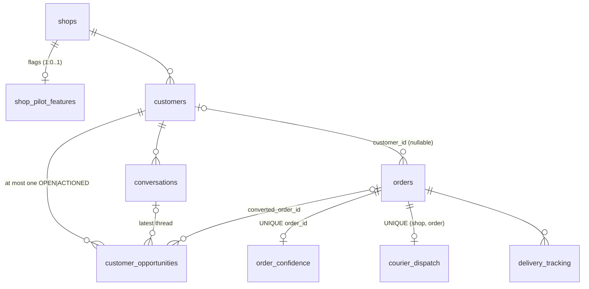
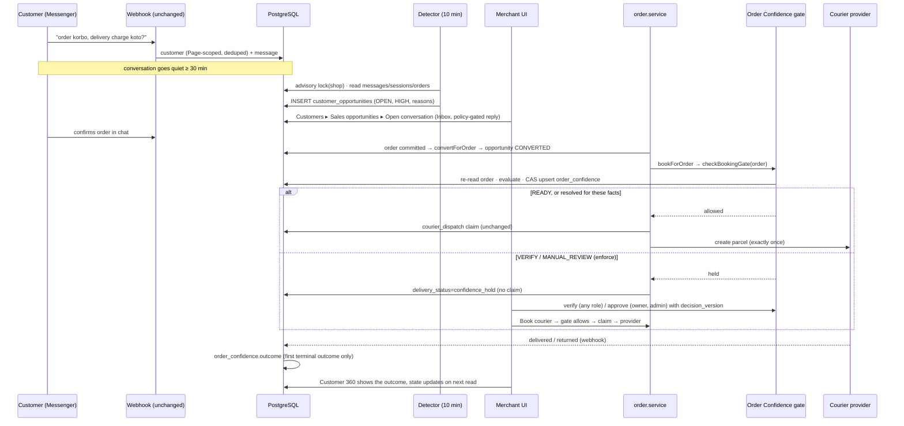
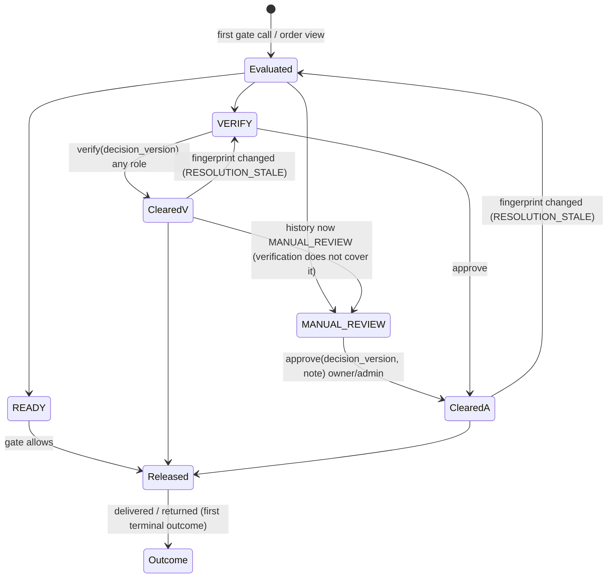

# Pilot Intelligence — Architecture

Status: Implemented (pilot) · Owner: Engineering
Decisions: [ADR-0005](../adr/0005-customer-identity-and-computed-state.md) ·
[ADR-0006](../adr/0006-opportunity-detection-sweep.md) ·
[ADR-0007](../adr/0007-order-confidence-gate-at-booking-boundary.md) ·
[ADR-0008](../adr/0008-manual-follow-up-only.md) ·
[ADR-0009](../adr/0009-pilot-feature-flags-table.md) ·
[ADR-0010](../adr/0010-order-confidence-concurrency.md)

## 1. Components and ownership

```mermaid
flowchart LR
  subgraph Inbound["Inbound (unchanged)"]
    W[Meta webhook<br/>meta-webhook-events.handler] --> C[(customers<br/>conversations<br/>messages)]
  end
  subgraph Worker["worker process"]
    J[opportunity-detector.job<br/>every 10 min] --> OS[opportunity.service]
  end
  OS -->|reads| C
  OS -->|reads| SES[(order_sessions)]
  OS -->|stage2-rules.classify| S2[ai/intent/stage2-rules.js]
  OS -->|writes| OPP[(customer_opportunities)]
  subgraph API["API process"]
    CI[customer-intelligence routes] --> C360[customer-360.service]
    CI --> OS
    OC[order-confidence routes] --> OCS[order-confidence.service]
    ORD[order.service<br/>_createOrderCore] -->|post-commit convertForOrder| OS
    BK[order.service<br/>bookForOrder] -->|checkBookingGate| OCS
    BK -->|claim / provider<br/>(unchanged)| CD[(courier_dispatch)]
    DT[delivery-tracking.service] -->|recordOutcome| OCS
    ADM[admin routes<br/>SUPER_ADMIN] --> PF[pilot-features.service]
  end
  C360 -->|reads| C
  C360 -->|reads| ORDERS[(orders)]
  OCS -->|reads| ORDERS
  OCS -->|checkPhone| RTO[rto-shield.service<br/>(unchanged)]
  OCS -->|CAS writes| OCT[(order_confidence)]
  PF --> SPF[(shop_pilot_features)]
  OCS -. reads flag .-> PF
  CI -. reads flag .-> PF
  J -. enabled shops .-> SPF
```

| Module | Owns | Never does |
| --- | --- | --- |
| `pilot-features/` | `shop_pilot_features`, the flag read (a failure reads as *off*), and counters | Read flags from `shops.settings` |
| `customer-intelligence/order-outcome.js` | The one definition of delivered, returned, cancelled or in progress, plus phone variants | Touch the database |
| `customer-intelligence/customer-state.js` | Lifecycle state and its reasons (pure) | Use AI output |
| `customer-intelligence/customer-orders.js` | Tenant-scoped order facts for customers, including phone association | Write links back |
| `customer-intelligence/customer-360.service.js` | List and detail read models | Write |
| `customer-intelligence/opportunity-signals.js` | Signal mapping and qualification (pure) | Store message text |
| `customer-intelligence/opportunity.service.js` | Detect, merge, convert, expire, merchant actions, list, summary | Send messages |
| `order-confidence/order-confidence.rules.js` | Decision rules, fingerprint, and effective state (pure) | Put PII in evidence |
| `order-confidence/order-confidence.service.js` | Facts, CAS persistence, gate, verify, approve, outcome, summary | Call the courier provider |
| `jobs/opportunity-detector.job.js` | The schedule and per-shop fan-out | Anything shop-specific beyond `detectForShop` |

The inbound webhook path, the AI worker, the policy engine, RTO Shield and the
courier claim/provider code are not modified. The only edits to existing flows
are three single-call hooks:

1. `bookForOrder` → the gate;
2. `_createOrderCore` → conversion;
3. `handleDeliveryWebhook` → outcome.

A boundary test pins these (`src/security/__tests__/pilot-intelligence-boundary.security.test.js`).

## 2. Entity relationships



An order with `customer_id IS NULL` relates to a customer only at read time,
by normalised phone.

## 3. End-to-end flow



## 4. Identity flow

1. **Inbound Messenger.** An existing, unchanged path. `findOrAdoptCustomer`
   runs inside the message transaction. A unique index on
   `(shop, channel_type, meta_channel_id, PSID)` makes concurrent first
   messages converge on one row, and receipt claim plus `external_id`
   deduplicate a replayed event.
2. **Order to customer.**
   - Linked when `orders.customer_id` is set; the chatbot path sets it from the
     Page-scoped session.
   - Otherwise associated only by exact normalised BD mobile
     (`phoneVariants()`), labelled `PHONE_MATCH`, never persisted.
   - If one phone matches several customers, the order shows on each, and
     `customer.phone_match_ambiguous` is counted.
3. **No merge.** Names are never used. Cross-shop data is never read.

## 5. Opportunity lifecycle

See [02-product.md §2](02-product.md#2-sales-opportunities-inside-customers).

The implementation invariants are:

| Invariant | Enforced by |
| --- | --- |
| At most one live opportunity per customer | Partial unique index `idx_customer_opportunities_live`; a `SequelizeUniqueConstraintError` on insert is skipped |
| One detector per shop at a time | `pg_try_advisory_xact_lock` on the key `opportunity-detector:<shop id>`; the loser records `detector_lock_skipped` |
| Merchant action versus detector | Every status change is `UPDATE … WHERE status IN (expected)`; a 0-row update means someone else acted first (409 to the merchant, skip for the detector) |
| No resurrection after dismissal | The cursor is the max of lookback start, last opportunity `last_signal_at`, and last order. The insert is skipped when an opportunity was resolved during this run. |
| Idempotent re-runs | Signals newer than the cursor only; a merge deduplicates by `(source, message_id or session, code)` |
| Conversion exactly once | `UPDATE … SET CONVERTED WHERE status IN ('OPEN','ACTIONED')`, by both the post-commit hook and the sweep |

## 6. Order-confidence lifecycle



- The decision is **recomputed on every gate call and every panel read**.
- A merchant clearance applies only while `resolution_fingerprint` equals the
  current order fingerprint **and** `resolution_level` ≥ the current decision
  level.
- A cancelled or refunded order is `bookable=false` whatever is cleared.

## 7. Courier integration boundary

`orderService.bookForOrder` runs these steps in order:

1. **Already booked?** An order with a consignment or tracking code returns
   that parcel. The gate is not consulted, so a late decision change cannot
   rebook or unbook a parcel.
2. **Courier resolution.** Unchanged. A missing setup still gives
   `courier_setup_required`.
3. **Data completeness.** Unchanged.
4. **Action Gate `BOOK_COURIER` authorization** for chatbot callers. Unchanged.
5. **Order Confidence gate** (new). It reloads the order from the database,
   evaluates it, and CAS-persists the result. If held and **no COMMITTED claim
   exists**, it marks `confidence_hold`, notifies once (dedupe
   `orderId:confidence_hold`), and returns `{blocked, status:'confidence_hold'}`.
   A COMMITTED claim always passes, so a parcel that was really booked
   reconciles.
6. **Durable claim** on `courier_dispatch` UNIQUE `(shop_id, order_id)` with
   an owner token. Unchanged.
7. **Provider call.** A timeout becomes INDETERMINATE and is never re-booked
   blindly. Unchanged.

The gate cannot create a parcel and cannot bypass the claim. A concurrent
`bookForOrder` can pass the gate twice, but only one owner wins the claim.

## 8. Failure behaviour

| Failure | Behaviour |
| --- | --- |
| Flag lookup fails | Reads as *off*: pre-pilot behaviour, counted as `pilot_features.lookup_failed` |
| History or RTO Shield lookup fails | That input becomes `INPUT_UNAVAILABLE`, which means VERIFY. The check fails closed to verification. |
| Gate evaluation throws | In `enforce`: held with `ENGINE_UNAVAILABLE` (manual route answers 409 `ORDER_CONFIDENCE_UNAVAILABLE`). In `shadow`: allowed. Recovery: fix the cause, or set the shop to `off`. |
| Concurrent evaluations | The unique `order_id` plus CAS: losers re-read the winner, and every evaluator computes the same decision from the same facts |
| Merchant approves an outdated view | 409 `DECISION_CHANGED` carrying `error.details.decision`, which the UI shows |
| Order edited after clearing | Fingerprint mismatch voids the clearance; history records `RESOLUTION_STALE` |
| Duplicate or out-of-order courier webhook | `recordOutcome` is `WHERE outcome IS NULL`; the tracking service also keeps terminal statuses |
| Redis down | Scheduled jobs do not run (pre-existing for all jobs), so there is no detection. The gate, APIs and conversion hook are Redis-independent. |
| Detector fails for one shop | That shop's transaction rolls back and the others continue; the next run retries |
| Provider timeout | Unchanged: INDETERMINATE claim, retries blocked until reconciled |

## 9. Scale notes

| Path | Queries | Growth |
| --- | --- | --- |
| Customers list page (20) | 4: customers + count, orders for those customers (`customer_id` index, plus `(shop_id, customer_phone)` for phone matches), conversation activity (grouped), live opportunities | Bounded by the page's customers and their orders |
| Customer detail | 8 fixed queries (customer, orders, conversations, opportunities, Page, message counts, confidence, tracking) plus RTO Shield (2–3) | Bounded per customer (orders ≤ 500 loaded) |
| Gate per booking | flags (PK), order (PK), history by phone or customer (≤ 500 rows), RTO Shield (2–3), confidence (unique) plus 1–2 CAS writes | Constant per booking |
| Detector per shop run | about 8 fixed queries plus 1 write per changed customer | Evaluates the **200 most recently active** conversations and newest 5,000 customer messages in the 72h window. A shop busier than that has older threads skipped: a known pilot limit, raised by config or batching when needed. |

Customer state is computed, so a **state filter or sort across all customers**
is not offered. That would need either persisting state or a SQL
re-implementation; see ADR-0005 for the trigger.
